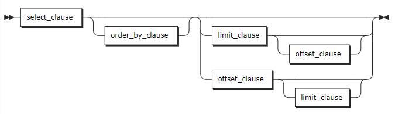
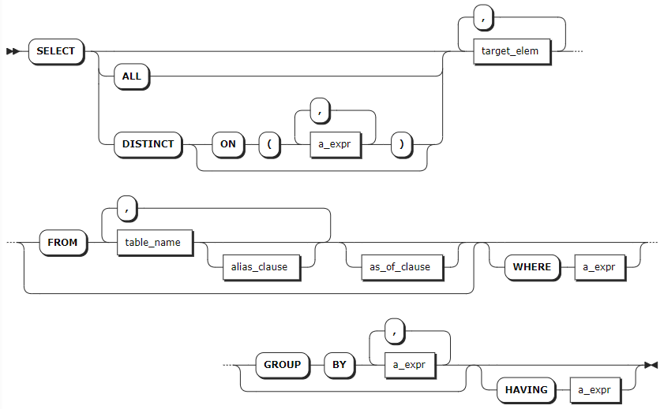
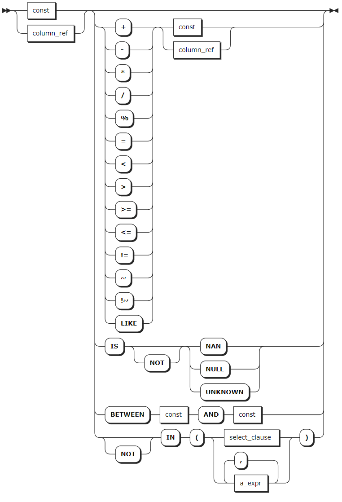
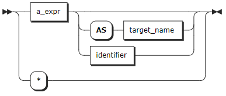
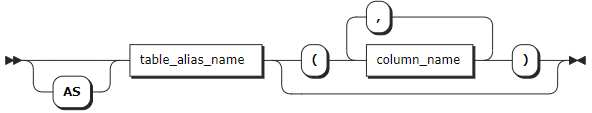
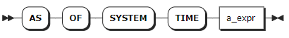
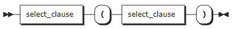
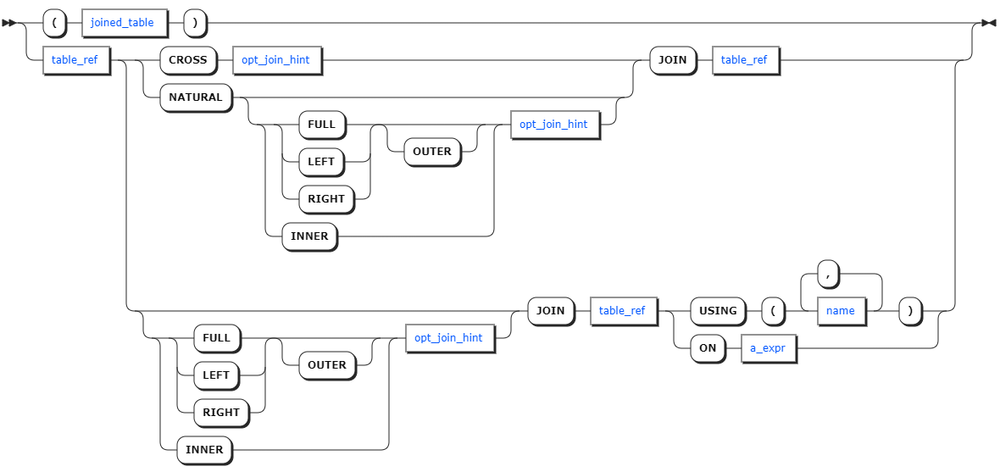
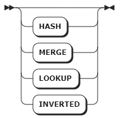
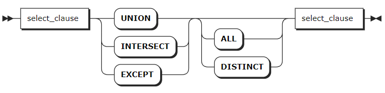

# SELECT

时序数据库支持使用 SQL 语句执行简单查询、嵌套查询、关联查询、联合查询和插值查询。

## 简单查询

`SELECT` 语句是读取和处理现有数据的主要 SQL 语法。当用作独立语句时，`SELECT` 子句也称为 `SELECT` 语句。但是，它也是一个选择子句，可以与其他结构组合以形成更复杂的选择查询。

KWDB 支持通过以下集群参数设置时序数据查询的相关配置：

- `SET CLUSTER SETTING ts.parallel_degree = <value>`：设置并行查询数目。
- `SET CLUSTER SETTING sql.auto_limit.quantity = <value>`：配置 SQL 查询结果的返回行数。
- `SET CLUSTER SETTING ts.ordered_table.enabled`：当用户未使用 `ORDER BY` 子句指定排序时，配置是否按照数据写入的时间戳逆序返回查询结果。当设置为 `true` 时，对于单设备查询，按照数据写入的时间戳逆序返回查询结果。对于多设备查询，先转换成单设备查询，然后再合并所有的数据。

更多参数设置，参见[集群实时参数](../../../db-operation/cluster-settings-config.md)。

KWDB 支持在查询中对列类型为时间戳、时间戳常量以及结果类型为时间戳的函数和表达式进行时间加减运算，运算结果支持使用大于号（`>`）、小于号（`<`）、等号（`=`）、大于等于号（`>=`）、小于等于号（`<=`）进行比较。运算中可以包含 `interval` 常量、其他时间戳列以及结果类型为 interval、timestamp 或 timstamptz 的函数和表达式。如果运算符两边均为 timestamp 或 timestamptz 类型，则只支持减法运算，差值对应的纳秒数不得超过 INT64 范围，对应的天数不得超过 `106751` 天。超出范围时，计算结果将取决于实际处理引擎，可能是正确的结果，也可能为 `106751 days 23:47:16.854776`。

加减运算中，`interval` 常量支持的单位包括毫秒（ms）、秒（s）、分（m）、小时（h）、天（d）、周（w）、月（mon）、年（y）。目前，KWDB 不支持复合时间格式，如 `1d1h`。

毫秒、秒、分、小时的取值范围受纳秒最大值（INT64）范围限制。下表列出具体支持的取值范围：

| 单位      | 取值范围                                |
| --------- | --------------------------------------- |
| 毫秒（ms） | [-9,223,372,036,854, 9,223,372,036,854] |
| 秒（s）    | [-9,223,372,036, 9,223,372,036]         |
| 分（m）    | [-153,722,867, 153,722,867]             |
| 小时（h）  | [-2,562,047, 2,562,047]                 |

天、周、月、年的取值范围受加减计算结果的限制。计算结果对应的毫秒数不得超过 INT64 范围。

::: warning 说明
时间加减表达式支持出现在以下位置：

- `SELECT` 列表：例如 `SELECT ts+1h FROM table1;` 将返回表中时间戳列加上 1 小时后的结果。
- `WHERE` 子句：例如 `SELECT * FROM table1 WHERE ts+1h > now();` 将返回表中时间戳列加上 1 小时后大于当前时间的数据。
- `ORDER BY` 子句：例如 `SELECT * FROM table1 ORDER BY ts+1h;` 将按时间戳列加上 1 小时后的值进行排序。
- `HAVING` 子句：例如 `SELECT MAX(ts) FROM table1 GROUP BY ts HAVING ts+1h > now();` 将筛选出满足条件的分组结果。
- 参数类型为 timestamp 的函数调用：例如 `SELECT CAST(ts+1h AS timestamp) FROM table1;` 可以将时间戳列加上 1 小时后的结果转换为 timestamp 类型。
- 使用比较运算符的表示连接条件：例如 `SELECT * FROM table1,table2 WHERE table1.ts+1h > table2.ts;` 表示在连接两个表时使用时间加减条件。

:::

### 所需权限

用户拥有目标表的 SELECT 权限。

### 语法格式



- `select_clause`

    

- `a_expr`

    

- `target_elem`

    

- `alias_clause`

    

- `as_of_clause`

    

### 参数说明

| 参数 | 说明 |
| --- | --- |
| `order_by_clause` | `ORDER BY` 子句由一个或多个排序规范组成，每个规范可以是标量表达式。系统通过给定的排序规范对结果集进行排序，可以指定 `ASC`（升序，默认）或 `DESC`（降序）关键字来控制排序顺序。|
| `limit_clause` | `LIMIT` 子句指定返回结果的最大行数。例如，`LIMIT 10` 表示限制查询结果最多为 10 行。支持设置为 `LIMIT ALL`，表示返回所有行。KWDB 也支持使用 `sql.auto_limit.quantity` 集群参数配置 SQL 查询结果的返回行数。但是，`Limit` 子句的优先级大于 `sql.auto_limit.quantity` 集群参数。 |
| `offset_clause` | `OFFSET` 子句用于跳过前面的偏移量行数。`OFFSET` 子句通常与 `LIMIT` 组合使用，通过限制结果的数量，实现分页显示结果，避免一次性检索所有数据。|
| `DISTINCT` | 当使用 `DISTINCT` 关键字时，系统删除返回结果中重复的行。 |
| `target_elem` | `target_elem` 可以是标量表达式，也可以是星号（`*`）。<br >- 当 `target_elem` 是标量表达式时，系统使用标量表达式计算每个结果行的值，然后将计算结果作为结果集中的一列返回。<br >- 当 `target_elem` 为星号（`*`）时，系统自动从 `FROM` 子句中检索所有列。如果 `target_elem` 包含聚合函数，可以使用 `GROUP BY` 子句进一步控制聚合。 |
| `alias_clause` | 别名子句，用于为表名或子查询结果集指定别名，使查询更易读和易于理解。|
| `as_of_clause` | 用于检索指定时间点的数据。<br >**说明** <br >由于系统时间返回的是历史数据，读取的结果可能会过时。|
| `WHERE` | `WHERE` 子句用于指定过滤条件，筛选出符合条件的行。格式为 `WHERE <column> <operator> <value>`，其中 `<operator>` 支持 `=`、`<>`、`<`、`<=`、`>`、`>=`、`LIKE` 操作符。`WHERE` 语句只检索表达式返回值为 `TRUE` 的行。列可以是数据列或标签列。 |
| `GROUP BY` | `GROUP BY` 子句根据表达式的规则将数据集划分成小组，然后对这些小组进行数据处理。聚合查询与 `GROUP BY` 连用时，应避免 `GROUP BY` 后的结果集行数过大。 |
| `HAVING` | 当 `WHERE` 关键字无法与聚合函数一起使用时，`HAVING` 子句可以用来筛选分组后的各组数据。通常情况下，`HAVING` 子句与 `GROUP BY` 子句联用，只检索 `a_expr` 表达式返回值为 `TRUE` 的聚合函数组。`a_expr` 必须是使用聚合函数返回布尔值的标量表达式（例如 `<聚合函数> = <value>`）。`HAVING` 子句的作用类似于 `WHERE` 子句，但适用于聚合函数。|

### 语法示例

- 查询时序表的数据。

    以下示例假设经创建 `ts_db` 数据库。以下示例查询 `t1` 时序表的数据。

    ```sql
    -- 1. 创建 t1 时序表并写入数据。

    CREATE TABLE ts_db.t1(ts timestamp not null,a int, b int) tags(tag1 int not null, tag2 int) primary tags(tag1);
    CREATE TABLE

    -- 2. 向表中写入数据。

    INSERT INTO ts_db.t1 VALUES(now(),11,11,33,44);
    INSERT INTO ts_db.t1 VALUES(now(),22,22,33,44);
    INSERT INTO ts_db.t1 VALUES(now(),11,33,33,44);
    INSERT INTO ts_db.t1 VALUES(now(),22,44,33,44);
    INSERT INTO ts_db.t1 VALUES(now(),33,55,44,44);
    INSERT INTO ts_db.t1 VALUES(now(),22,44,44,44);
    INSERT INTO ts_db.t1 VALUES(now(),33,44,55,44);
    INSERT INTO ts_db.t1 VALUES(now(),null,null,66,66);
    INSERT INTO ts_db.t1 VALUES(now(),null,null,66,77);

    -- 3. 查看表的内容。

    SELECT * FROM t1;
                  ts               |  a   |  b   | tag1 | tag2
    --------------------------------+------+------+------+-------
      2024-02-26 01:28:28.867+00:00 |   11 |   11 |   33 |   44
      2024-02-26 01:28:28.874+00:00 |   22 |   22 |   33 |   44
      2024-02-26 01:28:28.877+00:00 |   11 |   33 |   33 |   44
      2024-02-26 01:28:28.88+00:00  |   22 |   44 |   33 |   44
      2024-02-26 01:28:28.883+00:00 |   33 |   55 |   44 |   44
      2024-02-26 01:28:28.885+00:00 |   22 |   44 |   44 |   44
      2024-02-26 01:28:28.888+00:00 |   33 |   44 |   55 |   44
      2024-02-26 01:28:28.89+00:00  | NULL | NULL |   66 |   66
      2024-02-26 01:28:28.893+00:00 | NULL | NULL |   66 |   66
    (9 rows)
    ```

- 查询指定的数据列。

    以下示例查询 `t1` 表的 `a` 列并进行求和。

    ```sql
    SELECT sum(a) FROM ts_db.t1;
      sum
    -------
      154
    (1 row)
    ```

- 去重查询。

    以下示例对 `t1` 表的 `a` 列进行去重查询。

    ```sql
    SELECT DISTINCT a FROM ts_db.t1;
      a
    --------
        11
        22
        33
      NULL
    (4 rows)
    ```

- 使用 `WHERE` 语句过滤标签列。

    以下示例使用 `WHERE` 语句过滤 `t1` 表的 `a` 列。

    ```sql
    SELECT tag1 FROM ts_db.t1 WHERE a =11;
      tag1
    --------
        33
        33
    (2 rows)
    ```

- 使用 `GROUP BY` 和 `ORDER BY` 语句对数据列进行分类和排序。

    以下示例使用 `GROUP BY` 语句对 `t1` 表的 `a` 列进行分类和排序。

    ```sql
    SELECT a, max(b) FROM ts_db.t1 GROUP BY a ORDER BY a;
      a   | max
    -------+-------
      NULL | NULL
        11 |   33
        22 |   44
        33 |   55
    (4 rows)
    ```

## 嵌套查询

嵌套查询指在一个 SQL 查询中嵌套另一个完整的 SQL 查询，从而实现更复杂的数据检索。

KWDB 支持以下嵌套查询：

- 相关子查询（Correlated Subquery）：内部查询依赖于外部查询的结果，每次外部查询都触发内部查询。
- 非相关子查询（Non-Correlated Subquery）：内部查询独立于外部查询，只执行一次内部查询并返回固定的结果。
- 相关投影子查询（Correlated Scalar Subquery）：内部查询依赖于外部查询的结果，并且只返回一个单一的值作为外部查询的结果。
- 非相关投影子查询（Non-Correlated Scalar Subquery）：内部查询独立于外部查询，并且只返回一个单一的值作为外部查询的结果。
- `FROM` 子查询：将一个完整的 SQL 查询嵌套在另一个查询的 `FROM` 子句中，作为临时表格使用。

::: 说明

当 WHERE 条件中包含多个嵌套子查询和逻辑运算符（AND、OR），且某些子查询存在语义错误时，执行可能会报错 `internal error: invalid index`。

:::

### 所需权限

用户拥有目标表的 SELECT 权限。

### 语法格式



### 参数说明

无

### 语法示例

- 非相关子查询

    ```sql
    SELECT e1 FROM ts_stable1 WHERE e1 = (SELECT avg (e1) FROM t1.stable);
    e1
    (0 rows)
    ```

- 非相关投影子查询

    ```sql
    SELECT first (e1) = (SELECT e1 FROM ts_stable2 limit 1) FROM ts_stable1;
    ?column?
    -------------
    t
    (1 row)
    ```

- 相关子查询

    ```sql
    SELECT e1 FROM t1.stable WHERE e1 in (SELECT e1 FROM t1.stable2 WHERE stable.e2=stable2.e2);
    e1
    -----
    1000
    2000
    3000
    2000
    3000
    4000
    3000
    4000
    5000
    (9 rows)
    ```

- 相关投影子查询

    ```sql
    SELECT sum(e1) = (SELECT e1 FROM ts_stable2 WHERE ts_stable2.e1=e1) FROM ts_stable1;
    ?column?
    -------------
    t
    (1 row)
    ```

- `FROM` 子查询

    ```sql
    SELECT avg (a) FROM (SELECT e1 as a FROM t1.ts_stable1);
    avg
    ------
    1000
    (1 row)
    ```

## 关联查询

关联查询（JOIN QUERY）从多个表中获取相关联的数据，将其联接成一个结果集，从而得到更丰富的信息。KWDB 支持以下关联类型:

- 内连接（INNER JOIN）
- 左连接（LEFT JOIN）
- 右连接（RIGHT JOIN）
- 全连接（ FULL JOIN）

::: warning 说明

使用 `FULL JOIN` 时，避免在连接条件中使用子查询。

:::

### 所需权限

用户拥有目标表的 SELECT 权限。

### 语法格式



- `opt_join_hint`

    

### 参数说明

| 参数 | 说明 |
| --- | --- |
| `joined_table` | 连接表达式。|
| `table_ref` | 表的表达式。 |
| `opt_join_hint` | 可选项，连接提示。 |
| `a_expr` | ON 连接条件的标量表达式。 |
| `name` | USING 连接条件的列名。|

### 语法示例

```sql
SELECT ts_table1.e1, ts_table2.e1 FROM ts_table1 LEFT JOIN ts_table2 ON ts_table1.e1 = ts_table2.e1;
e1  | e1
----+-----
1000|1000
(1 row)
```

## 联合查询

联合查询（UNION QUERY）将具有相同列结构的多个查询结果组合成一个结果表。

### 所需权限

用户拥有目标表的 SELECT 权限。

### 语法格式



### 参数说明

| 参数 | 说明 |
| --- | --- |
| `UNION` | 将两个或多个查询结果合并成一个结果集，并自动去除重复的行。|
| `INTERSECT` | 将两个查询结果的交集作为最终结果集。 |
| `EXCEPT` | 返回只存在于第一个查询结果中而不存在于第二个查询结果中的行。 |

### 语法示例

```sql
SELECT e1 FROM t1.ts_stable1 UNION SELECT e1 FROM t1.ts_stable2;
e1    
------
1000
(1 row)
```
