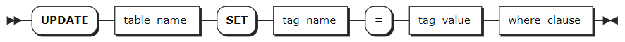

# UPDATE

`UPDATE` 语句用于更新时序表的标签值。

## 所需权限

用户是 `admin` 角色的成员或者拥有目标表的 UPDATE 和 SELECT 权限。默认情况下，`root` 用户属于 `admin` 角色。

## 语法格式



## 参数说明

| 参数 | 说明 |
| --- | --- |
| `table_name` | 表名，支持通过 `<database_name>.<table_name>` 指定其他数据库中的表。如未指定，则默认使用当前数据库。|
| `tag_name` | 待更新的标签名。目前，KWDB 不支持修改主标签的标签值。 |
| `tag_value` | 新标签值。 |
| `where_clause` | 指定待更新表的主标签和主标签值，格式为 `where <primary_tag> = <tag_value>`。标签值只支持常量。如果目标表有多个主标签，需要将所有主标签及主标签值都列出来，用 `and` 连接。|

## 语法示例

以下示例创建 `ts` 时序数据库和 `table1` 时序表，向表中写入数据，并更新 `table1` 时序表中 `tag3` 的标签值。

```sql
-- 1. 创建 ts 时序数据库。

CREATE TS DATABASE ts;
CREATE TS DATABASE

-- 2. 使用 ts 时序数据库。

USE ts;
SET

-- 3. 创建 table1 时序表。

CREATE TABLE table1 (time timestamp not null, e1 smallint, e2 float, e3 bool)
TAGS (tag1 smallint not null, tag2 int not null, tag3 bool)
PRIMARY TAGS (tag1, tag2);
CREATE TABLE

-- 4. 向表中写入数据。

INSERT INTO table1 VALUES ('2023-05-31 10:00:00', 1000,1000000,true, 1, 1, false), ('2023-05-31 11:00:00', 2000,2000000, true, 1, 1, false), ('2023-05-31 10:00:00', 1000,1000000,true, 2, 1, false), ('2023-05-31 11:00:00', 2000,2000000,true, 2, 1, false), ('2023-05-31 10:00:00', 1000,1000000,true, 3, 1, false), ('2023-05-31 11:00:00', 2000,2000000,true, 3, 1, false);
INSERT 6

-- 5. 查看表数据。

 SELECT * FROM table1;
            time            |  e1  |  e2   |  e3  | tag1 | tag2 | tag3
----------------------------+------+-------+------+------+------+--------
  2023-05-31 10:00:00+00:00 | 1000 | 1e+06 | true |    1 |    1 | false
  2023-05-31 11:00:00+00:00 | 2000 | 2e+06 | true |    1 |    1 | false
  2023-05-31 10:00:00+00:00 | 1000 | 1e+06 | true |    2 |    1 | false
  2023-05-31 11:00:00+00:00 | 2000 | 2e+06 | true |    2 |    1 | false
  2023-05-31 10:00:00+00:00 | 1000 | 1e+06 | true |    3 |    1 | false
  2023-05-31 11:00:00+00:00 | 2000 | 2e+06 | true |    3 |    1 | false
(6 rows)

-- 6. 指定表的主标签和主标签值，以更新 tag3 的标签值。

UPDATE table1 SET tag3 = true WHERE tag1 = 1 AND tag2 =1;
UPDATE 1

-- 7. 查看表数据。

SELECT * FROM table1;
            time            |  e1  |  e2   |  e3  | tag1 | tag2 | tag3
----------------------------+------+-------+------+------+------+--------
  2023-05-31 10:00:00+00:00 | 1000 | 1e+06 | true |    2 |    1 | false
  2023-05-31 11:00:00+00:00 | 2000 | 2e+06 | true |    2 |    1 | false
  2023-05-31 10:00:00+00:00 | 1000 | 1e+06 | true |    3 |    1 | false
  2023-05-31 11:00:00+00:00 | 2000 | 2e+06 | true |    3 |    1 | false
  2023-05-31 10:00:00+00:00 | 1000 | 1e+06 | true |    1 |    1 | true
  2023-05-31 11:00:00+00:00 | 2000 | 2e+06 | true |    1 |    1 | true
(6 rows)
```
