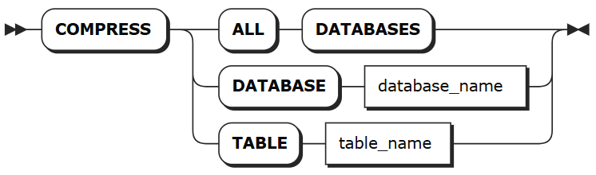

# 即时压缩

即时压缩功能专为需要快速响应的数据压缩需求设计，适合数据迁移或希望即时释放空间的场景，用户可根据需要手动执行 `COMPRESS` 压缩命令压缩所有时序数据、指定时序库下的所有数据或指定时序表的数据，系统将立即对所有符合条件的数据段执行压缩。

::: warning 注意
目前，关系数据不支持该语句。
:::


### 所需权限

用户是 `admin` 角色的成员。默认情况下，`root` 用户属于 `admin` 角色。

### 语法格式



### 参数说明

| 参数 | 说明 |
| --- | --- |
| `database_name` | 待压缩的时序库名。|
| `table_name` | 待压缩的时序表名。支持通过 <database_name>.<table_name> 指定其他数据库中的表。如未指定，则默认使用当前数据库。|

### 语法示例

以下示例假设已经创建 `sensor_data` 和 `device_data` 时序库，在 `sensor_data` 时序库下创建了 `temperature` 和 `pressure` 表并写入相关数据。

- 压缩指定时序库下的时序表。

    ```sql
    COMPRESS TABLE sensor_data.temperature;
    ```

- 压缩指定时序库下的所有时序表。

    ```sql
    COMPRESS DATABASE sensor_data;
    ```

- 压缩所有时序数据。

    ```sql
    COMPRESS ALL DATABASES;
    ```