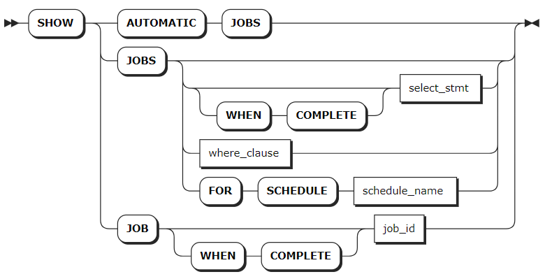
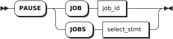
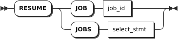
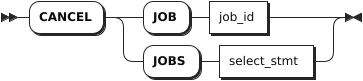

# 任务

## 查看任务

`SHOW JOBS` 语句用于查看过去 12 小时内执行的长时间运行的所有任务，包括：

- 模式更改，例如通过 `ALTER TABLE`、`DROP DATABASE` 和 `DROP TABLE` 语句触发的任务。
- 导入导出任务
- 历史重启任务
- 用户建表信息，供基于成本的优化器使用。自动表统计数据没有包含在 `SHOW JOBS` 语句的结果中。如需查看自动表统计信息，需要使用 `SHOW AUTOMATIC JOBS` 语句。

KWDB 首先查看正在运行的任务，然后再查看最近 12 小时内已完成的任务。正在运行的任务以开始时间排序，已完成的任务以结束时间排序。

::: warning 说明

- `SHOW JOBS` 语句仅用于查看长期运行的任务。如需查看正在运行的所有任务，可以使用 SQL 审核日志记录（实验性）功能。
- 如需查询运行时间超过 12 小时以上的任务，可查询 `kwdb_internal.jobs` 表。
- 默认情况下，系统保留 14 天内的任务记录。支持用户使用 `jobs.retention_time` 集群参数设置保留时间间隔。

:::

### 所需权限

用户为 root 用户。

### 语法格式



### 参数说明

| 参数 | 说明 |
| --- | --- |
| `SHOW AUTOMATIC JOBS` | 查看内部操作所需的任务。|
| `select_stmt` | 选择查询，用于指定要查看的一个或多个 `job_id`。|
| `where_clause` | 条件子句，用于查看历史记录中所有满足条件的任务。|
| `WHEN COMPLETE` | 任务达到终止状态后再执行 `SHOW JOBS` 或 `SHOW JOB` 语句。|
| `schedule_name` | 待查看的定时任务名称，更多定时任务信息，参见[定时任务](./schedules-sql.md)。|
| `job_id` | 待查看任务的 ID。|

### 返回字段说明

下表列出每个任务返回的字段。

| 字段                 | 描述                                                                                                                                                                                                                                                                                                                                                                                          |
| -------------------- | --------------------------------------------------------------------------------------------------------------------------------------------------------------------------------------------------------------------------------------------------------------------------------------------------------------------------------------------------------------------------------------------- |
| `job_id`               | 任务的唯一标识，用于暂停、恢复或取消任务。                                                                                                                                                                                                                                                                                                                                                |
| `job_type`             | 任务类型，包括：<br >- SCHEMA CHANGE（模式更改）<br >- IMPORT（导入）<br >- EXPORT（导出）<br >- CREATE_STATS（创建统计信息）<br >- AUTO_CREATE_STATS（自动创建统计信息）<br >- RESTART（历史重启）                                                                                                                                                                                                                          |
| `description`          | 启动任务的语句或任务的文字性描述。                                                                                                                                                                                                                                                                                                                                                            |
| `statement`            | 如果 `description` 参数为文字性描述，本字段将返回启动任务的语句。目前，只用于自动表统计信息的任务。                                                                                                                                                                                                                                                                                                 |
| `user_name`            | 启动任务的用户名。                                                                                                                                                                                                                                                                                                                                                                            |
| `status`               | 任务的当前状态，包括：<br >- `pending`：任务已创建，但未开始执行。 <br >- `running`：任务正在执行中，如果是多次执行的任务，表示总任务正在执行中。 <br >- `failed`：任务执行失败，如果是多次执行的任务，表示单次任务执行失败。 <br >- `succeeded`：任务成功完成且不会再次执行。 <br >- `canceled`：任务已取消。 <br >- `reverting`：任务失败或被取消，相关改动正在还原。 <br >- `revert-failed`：任务在还原更改时遇到无法重试的错误，需要用户手动清理此状态的任务。 |
| `running_status`       | 任务的详细运行状态，KWDB 提供 `DROP` 或 `TRUNCATE` 表的可视化进程。 `DROP` 或 `TRUNCATE` 表的运行状态取决于表格最初的模式变化。回收到期后，任务结束，表数据和 ID 被删除。执行 `SHOW AUDOTMATIC JOBS` 语句时，该字段值为 NULL。                                                                                                                                                                     |
| `created`              | 任务创建时的时间戳。                                                                                                                                                                                                                                                                                                                                                                          |
| `started`              | 任务开始运行时的时间戳。                                                                                                                                                                                                                                                                                                                                                                      |
| `finished`             | 任务处于 `succeeded`（成功）、`failed`（失败）、或者 `canceled`（已取消）状态时的时间戳。                                                                                                                                                                                                                                                                                                          |
| `modified`             | 任务修改时的时间戳。                                                                                                                                                                                                                                                                                                                                                                          |
| `errord`               | 任务发生错误时的时间戳。                                                                                                                                                                                                                                                                                                                                                                      |
| `fraction_completed`   | 任务完成比例，取值在 `0.00` 和 `1.00` 之间。                                                                                                                                                                                                                                                                                                                                                      |
| `error`                | 任务处于 `failed`（失败）状态后返回的错误。                                                                                                                                                                                                                                                                                                                                                     |
| `coordinator_id`       | 运行任务节点的 ID。                                                                                                                                                                                                                                                                                                                                                                           |
| `total_num_of_ex`      | 多次执行的任务执行的总次数。                                                                                                                                                                                                                                                                                                                                                                  |
| `total_num_of_success` | 多次执行的任务执行成功的总次数。                                                                                                                                                                                                                                                                                                                                                              |
| `total_num_of_fail`    | 多次执行的任务执行失败的总次数。                                                                                                                                                                                                                                                                                                                                                              |
| `time_of_last_success` | 多次执行的任务最近一次执行成功的时间。                                                                                                                                                                                                                                                                                                                                                        |

### 语法示例

- 查看所有任务。

    ```sql
    show jobs;
    ```

    执行成功后，控制台输出以下信息：

    ```sql
            job_id       |   job_type    |    description     | statement | user_name |  status   | running_status |             created              |             started              |             finished             |            modified             | errord | fraction_completed | error | coordinator_id | total_num_of_ex | total_num_of_success | total_num_of_fail |       time_of_last_success
    ---------------------+---------------+--------------------+-----------+-----------+-----------+----------------+----------------------------------+----------------------------------+----------------------------------+---------------------------------+--------+--------------------+-------+----------------+-----------------+----------------------+-------------------+-----------------------------------
      966387435059478529 | SCHEMA CHANGE | DROP DATABASE jobs |           | root      | succeeded | NULL           | 2024-05-06 09:40:40.481926+00:00 | 2024-05-06 09:40:40.511037+00:00 | 2024-05-06 09:40:40.518282+00:00 | 2024-05-06 09:40:40.51671+00:00 | NULL   |                  1 |       |              1 |               1 |                    1 |                 0 | 2024-05-06 09:40:40.518282+00:00
    (1 row)
    ```

- 使用 `SELECT` 和 `WHERE` 语句筛选任务。

    ```sql
    SELECT * FROM [SHOW JOBS] WHERE job_type = 'SCHEMA CHANGE';
    ```

    执行成功后，控制台输出以下信息：

    ```sql
    job_id            |job_type     |description                                                               |statement|user_name|status   |running_status|created                |started                |finished               |modified               |fraction_completed|error|coordinator_id| error_time
    ------------------|-------------|--------------------------------------------------------------------------|---------|---------|---------|--------------|-----------------------|-----------------------|-----------------------|-----------------------|------------------|-----|--------------|-----------
    902041667031498753|SCHEMA CHANGE|DROP DATABASE iot_db                                                      |         |kaiwudb  |succeeded|              |2023-09-22 03:01:10.452|2023-09-22 03:01:10.797|2023-09-22 03:01:11.249|2023-09-22 03:01:11.248|                 1|     |             1|
    (1 row)
    ```

- 使用 `WHERE` 子句筛选满足条件的历史任务。

    ```sql
    show jobs where job_type = 'SCHEMA CHANGE';
    ```

    执行成功后，控制台输出以下信息：

    ```sql
            job_id       |   job_type    |                                                                                                                                                    description                                                                                                                                                    | statement | user_name |  status   | running_status |             created              |             started              |             finished             |             modified             | errord | fraction_completed |                                       error                                        | coordinator_id | total_num_of_ex | total_num_of_success | total_num_of_fail |       time_of_last_success
    ---------------------+---------------+-------------------------------------------------------------------------------------------------------------------------------------------------------------------------------------------------------------------------------------------------------------------------------------------------------------------+-----------+-----------+-----------+----------------+----------------------------------+----------------------------------+----------------------------------+----------------------------------+--------+--------------------+------------------------------------------------------------------------------------+----------------+-----------------+----------------------+-------------------+-----------------------------------
      962704207243051009 | SCHEMA CHANGE | CREATE TABLE db2.public.orders (customer INT4, id INT4, total DECIMAL(20,5), PRIMARY KEY (customer, id), CONSTRAINT fk_customer FOREIGN KEY (customer) REFERENCES db2.public.customers) INTERLEAVE IN PARENT db2.public.customers (customer)                                                                      |           | root      | succeeded | NULL           | 2024-04-23 09:26:48.552734+00:00 | 2024-04-23 09:26:48.603675+00:00 | 2024-04-23 09:26:48.616608+00:00 | 2024-04-23 09:26:48.614163+00:00 | NULL   |                  1 |                                                                                    |              1 |               1 |                    1 |                 0 | 2024-04-23 09:26:48.616608+00:00
      962704207250391041 | SCHEMA CHANGE | updating referenced table;updating ancestor table                                                                                                                                                                                                                                                                 |           | root      | succeeded | NULL           | 2024-04-23 09:26:48.552734+00:00 | 2024-04-23 09:26:48.597467+00:00 | 2024-04-23 09:26:48.60655+00:00  | 2024-04-23 09:26:48.605119+00:00 | NULL   |                  1 |                                                                                    |              1 |               1 |                    1 |                 0 | 2024-04-23 09:26:48.60655+00:00
      962704243914113025 | SCHEMA CHANGE | CREATE TABLE db2.public.packages (customer INT4, "order" INT4, id INT4, address STRING(50), delivered BOOL, delivery_date DATE, PRIMARY KEY (customer, "order", id), CONSTRAINT fk_order FOREIGN KEY (customer, "order") REFERENCES db2.public.orders) INTERLEAVE IN PARENT db2.public.orders (customer, "order") |           | root      | succeeded | NULL           | 2024-04-23 09:26:59.743004+00:00 | 2024-04-23 09:26:59.799601+00:00 | 2024-04-23 09:26:59.810892+00:00 | 2024-04-23 09:26:59.809259+00:00 | NULL   |                  1 |                                                                                    |              1 |               1 |                    1 |                 0 | 2024-04-23 09:26:59.810892+00:00
      962704243924926465 | SCHEMA CHANGE | updating referenced table;updating ancestor table                                                                                                                                                                                                                                                                 |           | root      | succeeded | NULL           | 2024-04-23 09:26:59.743004+00:00 | 2024-04-23 09:26:59.791893+00:00 | 2024-04-23 09:26:59.806047+00:00 | 2024-04-23 09:26:59.803297+00:00 | NULL   |                  1 |                                                                                    |              1 |               1 |                    1 |                 0 | 2024-04-23 09:26:59.806047+00:00
      962907066109952001 | SCHEMA CHANGE | DROP TABLE db2.public.example_table, db2.public.testblob                                                                                                                                                                                                                                                          |           | root      | succeeded | NULL           | 2024-04-24 02:38:36.156104+00:00 | 2024-04-24 02:38:36.210874+00:00 | 2024-04-24 02:38:36.24302+00:00  | 2024-04-24 02:38:36.240734+00:00 | NULL   |                  1 |                                                                                    |              1 |               1 |                    1 |                 0 | 2024-04-24 02:38:36.24302+00:00
    ```

- 查看自动任务。

    ```sql
    SHOW AUTOMATIC JOBS;
    ```

    执行成功后，控制台输出以下信息：

    ```sql
    job_id            |job_type         |description                                             |statement                                                                                   |user_name|status   |running_status|created                |started                |finished               |modified               |fraction_completed|error|coordinator_id| error_time
    ------------------|-----------------|--------------------------------------------------------|--------------------------------------------------------------------------------------------|---------|---------|--------------|-----------------------|-----------------------|-----------------------|-----------------------|------------------|-----|--------------|-----------
    902025989139169281|AUTO CREATE STATS|Table statistics refresh for defaultdb."1".newtable     |CREATE STATISTICS __auto__ FROM [15093] WITH OPTIONS THROTTLING 0.9 AS OF SYSTEM TIME '-10s'|kaiwudb  |succeeded|              |2023-09-22 01:41:25.943|2023-09-22 01:41:25.950|2023-09-22 01:41:25.988|2023-09-22 01:41:25.986|                 1|     |             1|
    902024809042214913|AUTO CREATE STATS|Table statistics refresh for defaultdb."1".newtable     |CREATE STATISTICS __auto__ FROM [15093] WITH OPTIONS THROTTLING 0.9 AS OF SYSTEM TIME '-10s'|kaiwudb  |succeeded|              |2023-09-22 01:35:25.806|2023-09-22 01:35:25.901|2023-09-22 01:35:25.932|2023-09-22 01:35:25.931|                 1|     |             1|
    (2 rows)
    ```

## 暂停任务

PAUSE JOB 语句用于暂停导入导出任务、用户创建的表统计信息任务和自动表统计信息任务。
任务暂停后，支持使用 RESUME JOB 语句恢复任务。

::: warning 说明

- 无法暂停模式更改任务。
- 如需禁用自动表统计信息任务，可以将 `sql.stats.automatic_collection.enabled` 集群参数设置为 `false`。

:::

### 所需权限

用户为 root 用户。

### 语法格式



### 参数说明

| 参数 | 说明 |
| --- | --- |
| `job_id` | 待暂停任务的 ID，支持使用 `SHOW JOBS` 语句查看任务 ID。|
| `select_stmt` | 选择查询子句，返回待暂停任务的 ID。|

### 语法示例

- 暂停单个任务。

    ```sql
    PAUSE JOB 505396193949089793;
    ```

- 使用 `SELECT` 子句查询任务 ID 并暂停多个任务。

    ```sql
    PAUSE JOBS (SELECT job_id FROM [SHOW JOBS] WHERE user_name = 'stone');
    ```

## 恢复任务

`RESUME JOB` 语句用于恢复已暂停的任务。

### 所需权限

用户为 root 用户。

### 语法格式



### 参数说明

| 参数 | 说明 |
| --- | --- |
| `job_id` | 待恢复任务的 ID，支持使用 `SHOW JOBS` 语句查看任务 ID。|
| `select_stmt` | 选择查询子句，返回待恢复任务的 ID。|

### 语法示例

- 恢复单个任务。

    ```sql
    RESUME JOB 27536791415282;
    ```

- 使用 `SELECT` 子句查询任务 ID 并恢复多个任务。

    ```sql
    RESUME JOBS (SELECT job_id FROM [SHOW JOBS] WHERE user_name = 'stone');
    ```

## 取消任务

`CANCEL JOB` 语句用于停止长时间运行的任务，包括模式更改、用户创建的表统计信息任务、自动表统计信息任务。

::: warning 说明

取消自动表统计信息任务后，系统会立即自动重启该任务。如需禁用自动表统计信息任务，可以将 `sql.stats.automatic_collection.enabled` 集群参数设置为 `false`。

:::

### 所需权限

用户是 `admin` 角色的成员。默认情况下，`root` 用户属于 `admin` 角色。

### 语法格式



### 参数说明

| 参数 | 说明 |
| --- | --- |
| `job_id` | 待取消任务的 ID，支持使用 `SHOW JOBS` 语句查看任务 ID。|
| `select_stmt` | 选择查询子句，返回待取消任务的 ID。|

### 语法示例

- 取消单个任务。

    ```sql
    CANCEL JOB 27536791415282;
    ```

- 使用 `SELECT` 子句查询任务 ID 并取消多个任务。

    ```sql
    CANCEL JOBS (SELECT job_id FROM [SHOW JOBS] WHERE user_name = 'stone');
    ```
