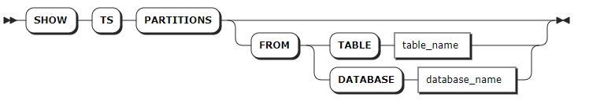

# 分区

## 查看分区

`SHOW TS PARTITIONS` 语句用于查看集群内所有的分区大小以及时序数据的分布。

::: warning 说明

- KWDB 支持使用 `SELECT * FROM [SHOW TS PARTITIONS FROM TABLE <table_name>] WHERE_clause` 过滤查询信息。
- 如需查看集群内所有数据的整体分布，使用 `SELECT * FROM kwdb_internal.ranges` 语句。

:::

### 所需权限

用户拥有 Admin（ALL）权限。

### 语法格式



### 参数说明

| 参数 | 说明 |
| --- | --- |
| `table_name` | 待查看数据分布的时序表名。 |
| `database_name` | 待查看数据分布的数据库名。 |

### 返回字段说明

| 字段          | 描述                    |
| ------------- | ----------------------- |
| `partition_id`  | 分区 ID                 |
| `start_pretty`  | 分区起始 key            |
| `end_pretty`    | 分区终止 key            |
| `database_name` | 数据库名                |
| `table_name`    | 表名                    |
| `lease_holder`  | leaseholder 对应节点 ID |
| `replicas`      | 副本对应节点 ID         |
| `size`          | 数据大小                |
| `status`        | 状态                    |

### 语法示例

- 查看所有分区信息。

    ```sql
    SHOW TS PARTITIONS;
      partition_id |  start_pretty   |   end_pretty    | database_name | table_name  | lease_holder | replicas | size | status
    ---------------+-----------------+-----------------+---------------+-------------+--------------+----------+------+----------
                0 | /Table/83       | /Table/83/6553  | tsdb          | sensor_data |            1 | {1}      | 6553 | running
                1 | /Table/83/6553  | /Table/83/13106 | tsdb          | sensor_data |            1 | {1}      | 6553 | running
                2 | /Table/83/13106 | /Table/83/19659 | tsdb          | sensor_data |            1 | {1}      | 6553 | running
                3 | /Table/83/19659 | /Table/83/26212 | tsdb          | sensor_data |            1 | {1}      | 6553 | running
                4 | /Table/83/26212 | /Table/83/32765 | tsdb          | sensor_data |            1 | {1}      | 6553 | running
                5 | /Table/83/32765 | /Table/83/39318 | tsdb          | sensor_data |            1 | {1}      | 6553 | running
                6 | /Table/83/39318 | /Table/83/45871 | tsdb          | sensor_data |            1 | {1}      | 6553 | running
                7 | /Table/83/45871 | /Table/83/52424 | tsdb          | sensor_data |            1 | {1}      | 6553 | running
                8 | /Table/83/52424 | /Table/83/58977 | tsdb          | sensor_data |            1 | {1}      | 6553 | running
                9 | /Table/83/58977 | /Table/84       | tsdb          | sensor_data |            1 | {1}      | 6553 | running
    ...
    (60 rows)
    ```

- 查看指定表的数据分布信息。

    ```sql
    SHOW TS PARTITIONS FROM TABLE t1;
      partition_id |  start_pretty   |   end_pretty    | database_name | table_name | lease_holder | replicas | size | status
    ---------------+-----------------+-----------------+---------------+------------+--------------+----------+------+----------
                0 | /Table/78       | /Table/78/6553  | tsdb          | t1         |            1 | {1}      | 6553 | running
                1 | /Table/78/6553  | /Table/78/13106 | tsdb          | t1         |            1 | {1}      | 6553 | running
                2 | /Table/78/13106 | /Table/78/19659 | tsdb          | t1         |            1 | {1}      | 6553 | running
                3 | /Table/78/19659 | /Table/78/26212 | tsdb          | t1         |            1 | {1}      | 6553 | running
                4 | /Table/78/26212 | /Table/78/32765 | tsdb          | t1         |            1 | {1}      | 6553 | running
                5 | /Table/78/32765 | /Table/78/39318 | tsdb          | t1         |            1 | {1}      | 6553 | running
                6 | /Table/78/39318 | /Table/78/45871 | tsdb          | t1         |            1 | {1}      | 6553 | running
                7 | /Table/78/45871 | /Table/78/52424 | tsdb          | t1         |            1 | {1}      | 6553 | running
                8 | /Table/78/52424 | /Table/78/58977 | tsdb          | t1         |            1 | {1}      | 6553 | running
                9 | /Table/78/58977 | /Table/79       | tsdb          | t1         |            1 | {1}      | 6553 | running
    (10 rows)
    ```

- 查看指定数据库的数据分布信息。

    ```sql
    show ts partitions from database tsdb;
      partition_id |  start_pretty   |   end_pretty    | database_name | table_name  | lease_holder | replicas | size | status
    ---------------+-----------------+-----------------+---------------+-------------+--------------+----------+------+----------
                0 | /Table/83       | /Table/83/6553  | tsdb          | sensor_data |            1 | {1}      | 6553 | running
                1 | /Table/83/6553  | /Table/83/13106 | tsdb          | sensor_data |            1 | {1}      | 6553 | running
                2 | /Table/83/13106 | /Table/83/19659 | tsdb          | sensor_data |            1 | {1}      | 6553 | running
                3 | /Table/83/19659 | /Table/83/26212 | tsdb          | sensor_data |            1 | {1}      | 6553 | running
                4 | /Table/83/26212 | /Table/83/32765 | tsdb          | sensor_data |            1 | {1}      | 6553 | running
                5 | /Table/83/32765 | /Table/83/39318 | tsdb          | sensor_data |            1 | {1}      | 6553 | running
                6 | /Table/83/39318 | /Table/83/45871 | tsdb          | sensor_data |            1 | {1}      | 6553 | running
                7 | /Table/83/45871 | /Table/83/52424 | tsdb          | sensor_data |            1 | {1}      | 6553 | running
                8 | /Table/83/52424 | /Table/83/58977 | tsdb          | sensor_data |            1 | {1}      | 6553 | running
                9 | /Table/83/58977 | /Table/84       | tsdb          | sensor_data |            1 | {1}      | 6553 | running
                0 | /Table/78       | /Table/78/6553  | tsdb          | t1          |            1 | {1}      | 6553 | running
                1 | /Table/78/6553  | /Table/78/13106 | tsdb          | t1          |            1 | {1}      | 6553 | running
                2 | /Table/78/13106 | /Table/78/19659 | tsdb          | t1          |            1 | {1}      | 6553 | running
                3 | /Table/78/19659 | /Table/78/26212 | tsdb          | t1          |            1 | {1}      | 6553 | running
                4 | /Table/78/26212 | /Table/78/32765 | tsdb          | t1          |            1 | {1}      | 6553 | running
                5 | /Table/78/32765 | /Table/78/39318 | tsdb          | t1          |            1 | {1}      | 6553 | running
                6 | /Table/78/39318 | /Table/78/45871 | tsdb          | t1          |            1 | {1}      | 6553 | running
                7 | /Table/78/45871 | /Table/78/52424 | tsdb          | t1          |            1 | {1}      | 6553 | running
                8 | /Table/78/52424 | /Table/78/58977 | tsdb          | t1          |            1 | {1}      | 6553 | running
                9 | /Table/78/58977 | /Table/79       | tsdb          | t1          |            1 | {1}      | 6553 | running
                0 | /Table/79       | /Table/79/6553  | tsdb          | t2          |            1 | {1}      | 6553 | running
                1 | /Table/79/6553  | /Table/79/13106 | tsdb          | t2          |            1 | {1}      | 6553 | running
                2 | /Table/79/13106 | /Table/79/19659 | tsdb          | t2          |            1 | {1}      | 6553 | running
                3 | /Table/79/19659 | /Table/79/26212 | tsdb          | t2          |            1 | {1}      | 6553 | running
                4 | /Table/79/26212 | /Table/79/32765 | tsdb          | t2          |            1 | {1}      | 6553 | running
                5 | /Table/79/32765 | /Table/79/39318 | tsdb          | t2          |            1 | {1}      | 6553 | running
                6 | /Table/79/39318 | /Table/79/45871 | tsdb          | t2          |            1 | {1}      | 6553 | running
                7 | /Table/79/45871 | /Table/79/52424 | tsdb          | t2          |            1 | {1}      | 6553 | running
                8 | /Table/79/52424 | /Table/79/58977 | tsdb          | t2          |            1 | {1}      | 6553 | running
                9 | /Table/79/58977 | /Table/80       | tsdb          | t2          |            1 | {1}      | 6553 | running
                0 | /Table/80       | /Table/80/6553  | tsdb          | t3          |            1 | {1}      | 6553 | running
                1 | /Table/80/6553  | /Table/80/13106 | tsdb          | t3          |            1 | {1}      | 6553 | running
                2 | /Table/80/13106 | /Table/80/19659 | tsdb          | t3          |            1 | {1}      | 6553 | running
                3 | /Table/80/19659 | /Table/80/26212 | tsdb          | t3          |            1 | {1}      | 6553 | running
                4 | /Table/80/26212 | /Table/80/32765 | tsdb          | t3          |            1 | {1}      | 6553 | running
                5 | /Table/80/32765 | /Table/80/39318 | tsdb          | t3          |            1 | {1}      | 6553 | running
                6 | /Table/80/39318 | /Table/80/45871 | tsdb          | t3          |            1 | {1}      | 6553 | running
                7 | /Table/80/45871 | /Table/80/52424 | tsdb          | t3          |            1 | {1}      | 6553 | running
                8 | /Table/80/52424 | /Table/80/58977 | tsdb          | t3          |            1 | {1}      | 6553 | running
                9 | /Table/80/58977 | /Table/81       | tsdb          | t3          |            1 | {1}      | 6553 | running
                0 | /Table/81       | /Table/81/6553  | tsdb          | t4          |            1 | {1}      | 6553 | running
                1 | /Table/81/6553  | /Table/81/13106 | tsdb          | t4          |            1 | {1}      | 6553 | running
                2 | /Table/81/13106 | /Table/81/19659 | tsdb          | t4          |            1 | {1}      | 6553 | running
                3 | /Table/81/19659 | /Table/81/26212 | tsdb          | t4          |            1 | {1}      | 6553 | running
                4 | /Table/81/26212 | /Table/81/32765 | tsdb          | t4          |            1 | {1}      | 6553 | running
                5 | /Table/81/32765 | /Table/81/39318 | tsdb          | t4          |            1 | {1}      | 6553 | running
                6 | /Table/81/39318 | /Table/81/45871 | tsdb          | t4          |            1 | {1}      | 6553 | running
                7 | /Table/81/45871 | /Table/81/52424 | tsdb          | t4          |            1 | {1}      | 6553 | running
                8 | /Table/81/52424 | /Table/81/58977 | tsdb          | t4          |            1 | {1}      | 6553 | running
                9 | /Table/81/58977 | /Table/82       | tsdb          | t4          |            1 | {1}      | 6553 | running
                0 | /Table/82       | /Table/82/6553  | tsdb          | t5          |            1 | {1}      | 6553 | running
                1 | /Table/82/6553  | /Table/82/13106 | tsdb          | t5          |            1 | {1}      | 6553 | running
                2 | /Table/82/13106 | /Table/82/19659 | tsdb          | t5          |            1 | {1}      | 6553 | running
                3 | /Table/82/19659 | /Table/82/26212 | tsdb          | t5          |            1 | {1}      | 6553 | running
                4 | /Table/82/26212 | /Table/82/32765 | tsdb          | t5          |            1 | {1}      | 6553 | running
                5 | /Table/82/32765 | /Table/82/39318 | tsdb          | t5          |            1 | {1}      | 6553 | running
                6 | /Table/82/39318 | /Table/82/45871 | tsdb          | t5          |            1 | {1}      | 6553 | running
                7 | /Table/82/45871 | /Table/82/52424 | tsdb          | t5          |            1 | {1}      | 6553 | running
                8 | /Table/82/52424 | /Table/82/58977 | tsdb          | t5          |            1 | {1}      | 6553 | running
                9 | /Table/82/58977 | /Table/83       | tsdb          | t5          |            1 | {1}      | 6553 | running
    (60 rows)
    ```
