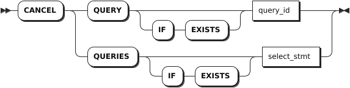

# 查询

## 查看查询

`SHOW QUERIES` 语句用于获取 SQL 语句执行的进度信息。

### 所需权限

用户拥有 Admin 权限。默认情况下，root 用户具有 Admin 角色。

### 语法格式


### 参数说明

| 参数 | 说明 |
| --- | --- |
| `CLUSTER` | 可选关键字，查看集群内所有节点上正在执行的查询。|
| `LOCAL` | 可选关键字，查看本地节点上正在执行的查询。|

### 返回字段说明

| 字段             | 描述                                                                                         |
| ---------------- | -------------------------------------------------------------------------------------------- |
| `query_id`         | 查询 ID。                                                                                      |
| `node_id`          | 当前连接的节点 ID。                                                                            |
| `session_id`       | 当前连接的会话 ID。                                                                        |
| `user_name`        | 用户名。                                                                                       |
| `start`            | 查询开始运行时的时间戳。                                                                       |
| `query`            | 查询语句。                                                                                     |
| `client_address`   | 客户端地址。                                                                                   |
| `application_name` | 应用名。                                                                                       |
| `distributed`      | 是否是分布式。                                                                                 |
| `phase`            | 查询执行的阶段，包括：<br >- `prepare`：系统正在解析查询语句和生成执行计划。<br >- `executing` 系统正在执行查询语句。 |
| `exec_progress`    | 查询处于 `executing` 阶段时，语句的执行进度。                                                      |

### 语法示例

- 查看集群内所有节点上正在执行的查询。

    ```sql
    SHOW QUERIES;
    ```

    执行成功后，控制台输出以下信息：

    ```sql
                  query_id             | node_id |            session_id            | user_name |              start               |        query         |  client_address  | application_name | distributed |   phase   | exec_progress
    -----------------------------------+---------+----------------------------------+-----------+----------------------------------+----------------------+------------------+------------------+-------------+-----------+----------------
      17c9796fa28ec8a10000000000000001 |       1 | 17c962175c4579860000000000000001 | root      | 2024-04-25 08:44:13.566642+00:00 | SHOW CLUSTER QUERIES | 172.18.0.1:47104 | $ kwbase sql     |    false    | executing |             0
    (1 row)
    ```

- 查看本地节点上所有正在执行的查询。

    ```sql
    SHOW LOCAL QUERIES;
    ```

    执行成功后，控制台输出以下信息：

    ```sql
                  query_id             | node_id |            session_id            | user_name |              start               |       query        |  client_address  | application_name | distributed |   phase   | exec_progress
    -----------------------------------+---------+----------------------------------+-----------+----------------------------------+--------------------+------------------+------------------+-------------+-----------+----------------
      17c9796c44bef85c0000000000000001 |       1 | 17c962175c4579860000000000000001 | root      | 2024-04-25 08:43:59.107805+00:00 | SHOW LOCAL QUERIES | 172.18.0.1:47104 | $ kwbase sql     |    false    | executing |             0
    (1 row)
    ```

## 取消查询

`CANCEL QUERY` 语句用于取消正在运行的 SQL 查询。

::: warning 说明

- 模式更改查询与其他 SQL 查询的处理方式不同。用户可以使用 `SHOW JOBS` 语句用来查看模式更改的进度，使用 `CANCEL JOB` 语句取消花费时间超出预期的模式更改任务。
- 在极少数情况下，当发出取消查询请求时，如果查询即将完成，系统可能会选择运行完查询。

:::

### 所需权限

- Admin 用户 (默认情况下，root 用户具有 Admin 角色。)：取消任何当前正在进行的查询。
- 非 Admin 用户：取消自己当前正在运行的查询。

### 语法格式



### 参数说明

| 参数 | 说明 |
| --- | --- |
| `IF EXISTS` | 可选关键字。当使用 `IF EXISTS` 关键字时，如果目标查询存在，系统取消目标查询。如果目标查询不存在，系统取消查询失败，但不会报错。当未使用 `IF EXISTS` 关键字时，如果目标查询存在，系统取消查询。如果目标查询不存在，系统报错，提示目标查询不存在。|
| `query_id` | 待取消查询的 ID。|
| `select_stmt` | 待取消的查询语句。|

::: warning 说明
`CANCEL QUERY` 语句只能取消单个查询。如果使用子查询，且子查询返回了多个查询 ID，需使用 `CANCEL QUERIES` 语句。
:::

### 语法示例

- 通过查询 ID 取消查询。

    ```sql
    -- 1. 使用 SHOW QUERIES 语句获取查询 ID。

    SHOW QUERIES;
                  query_id             | node_id |            session_id            | user_name |              start               |        query         |  client_address  | application_name | distributed |   phase   | exec_progress
    -----------------------------------+---------+----------------------------------+-----------+----------------------------------+----------------------+------------------+------------------+-------------+-----------+----------------
      17c9796fa28ec8a10000000000000001 |       1 | 17c962175c4579860000000000000001 | root      | 2024-04-25 08:44:13.566642+00:00 | SHOW CLUSTER QUERIES | 172.18.0.1:47104 | $ kwbase sql     |    false    | executing |             0
    (1 row)

    -- 2. 根据查询 ID 取消特定查询。

    CANCEL QUERY '17c9796fa28ec8a10000000000000001';
    CANCAL QUERIES 1
    ```

- 通过 `SELECT` 子查询获取查询 ID，然后取消查询。

    ```sql
    CANCEL QUERY (SELECT query_id FROM [SHOW CLUSTER QUERIES] WHERE client_address='192.168.0.30:53888' AND user_name='root' AND query = 'SHOW CLUSTER QUERIES');
    CANCAL QUERIES 1
    ```
