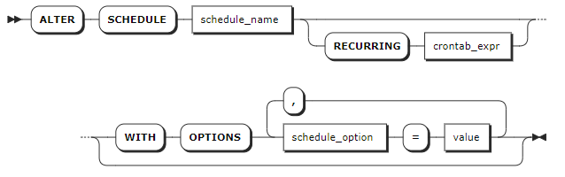
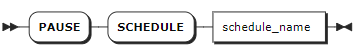

# 定时任务

SCHEDULE，即定时任务，指按照预定的时间或事件自动执行特定的数据库任务。

KWDB 支持授权用户根据需要执行以下定时任务相关操作：

- 通过 `CREATE SCHEDULE` 语句创建定时任务。
- 通过 `SHOW SCHEDULE` 语句查看创建的定时任务的调度周期、执行时间、执行状态等信息。
- 通过 `SHOW JOBS FOR SCHEDULE` 命令查看任务在历史和当前周期执行的开始时间、结束时间、执行进度、执行结果、错误信息等。更多信息，参见[查看任务](./jobs-sql.md)。
- 通过 `ALTER SCHEDULE` 语句修改调度周期、任务执行错误处理策略、或者前一次任务调度尚未执行完成的处理策略。
- 通过 `PAUSE SCHEDULE` 语句暂停后台计划任务的调度。
- 通过 `RESUME SCHEDULE` 语句恢复暂停的定时任务。
- 通过 `DROP SCHEDULE` 语句删除定时任务。

KWDB 每 `60` 秒扫描一次定时任务列表，随机找出应该执行的 `10` 个定时任务，并执行相关联的任务。KWDB 支持用户通过 `SET CLUSTER SETTING <parameter> = <value>` 语句修改以下实时参数关闭实时任务功能，修改扫描频率和每次执行的任务数：

- `jobs.scheduler.enabled`：开启或关闭定时任务功能。默认值为 `TRUE`，表示开启功能。
- `jobs.scheduler.pace`：扫描任务表 `system.scheduled_jobs` 的频率。默认值为 `60` 秒，设置值不能小于 `60s`。如果设置值小于 `60s`，将采用默认值 `60s`。
- `jobs.scheduler.max_jobs_per_iteration`：每次扫描执行的最大任务数。默认值为 `10`。取值为 `0`，表示无任务数限制。

## 创建定时任务

### 所需权限

用户是 `admin` 角色的成员。默认情况下，`root` 用户属于 `admin` 角色。

### 语法格式


### 参数说明

| 参数 | 说明 |
| --- | --- |
| `IF NOT EXISTS` | 可选关键字。当使用 `IF NOT EXISTS` 关键字时，如果目标定时任务不存在，系统创建目标定时任务。如果目标定时任务存在，系统创建定时任务失败，但不会报错。当未使用 `IF NOT EXISTS` 关键字时，如果目标定时任务不存在，系统创建定时任务。如果目标定时任务存在，系统报错，提示目标定时任务已存在。 |
| `schedule_name` | 可选参数，待创建定时任务的名称。如未指定目标定时任务的名称，系统自动生成一个名称，例如 `EXEC SQL 1718951529`。定时任务名称必须唯一，支持字符串形式的名称，不支持数字形式的名称。如果使用 `IF NOT EXISTS` 关键字，则必须指定定时任务的名称。|
| `sconst` | 指定的 SQL 语句。目前，只支持 `INSERT`、`UPDATE`、`DELETE` 语句。SQL 语句需要指定具体的数据库和表。|
| `RECURRING crontab_expr` | 指定定时任务执行的时间点和周期，支持以下字段表达方式：<br >- 7 字段表达式，即全字段表达式，字段之间使用空格分隔（`<seconds> <minutes> <hours> <day-of-month> <month> <day-of-week> <year>`）。<br >- 6 字段表达式，字段之间使用空格分隔（`<minutes> <hours> <day-of-month> <month> <day-of-week> <year>`）。其中 `seconds` 预设为 `0`，表示 `0` 秒执行。<br >- 5 字段表达式，字段之间使用空格分隔（`<minutes> <hours> <day-of-month> <month> <day-of-week>`），其中，`year` 字段预设为 `*`，表示所有年份都适用。<br > - 预定义表达式，具体包括 `@annually`（每年 1 月 1 日 0 点 0 分 0 秒运行一次）、`@yearly`（每年 1 月 1 日 0 点 0 分 0 秒运行一次，同`@annually`）、`@monthly`（每月 1 日 0 点 0 分 0 秒运行一次）、`@weekly`（每周日 0 点 0 分 0 秒运行一次）、`@daily`（每天 0 点 0 分 0 秒运行一次）、`@hourly`（每小时 0 分 0 秒开始时运行）<br > 有关字段表达式的详细说明，参见[字段表达式说明](#字段表达式说明)。|
| `schedule_option` |执行定时任务的选项，支持以下可选设置：<br > `first_run`：指定在特定时间执行定时任务。如未指定，默认在下一个 `RECURRING` 时间执行定时任务，支持 TIMESTAMPTZ 类型和 `NOW`。<br > `on_execution_failure`：指定在执行过程中发生错误时应执行的操作。支持以下选项：<br >- `retry`：立即重试执行定时任务。 <br >- `pause`：表示暂停定时任务。暂停后，用户需要手动恢复定时任务。 <br >- `reschedule`：（默认值）表示在下一个 `RECURRING` 时间执行重试执行定时任务。<br > `on_previous_running`：如果之前的定时任务仍在运行中，如何执行新的定时任务。支持以下选项：<br >- `start`：立即执行新的定时任务。 <br >- `skip`：不执行新的定时任务。 <br >- `wait`：（默认值）等上一个定时任务完成后，再执行新的定时任务。|

### 字段表达式说明

<table>
  <thead>
    <tr>
      <th width="130">字段名称</th>
      <th width="170">取值范围</th>
      <th width="150">特殊字符</th>
      <th>特殊字符说明</th>
    </tr>
  </thead>
  <tbody>
    <tr>
      <td><code>seconds</code></td>
      <td><code>[0, 59]</code></td>
      <td>
      <ul>
      <li>星号（<code>*</code>）</li>
      <li>逗号（<code>,</code>）</li>
      <li>连字符（<code>-</code>）</li>
      <li>斜线（<code>/</code>）</li>
      </ul>
      </td>
      <td rowspan="7">
      <ul>
      <li>星号（<code>*</code>）：表示与字段的所有值匹配。例如，<code>0 0 0 1 1 * *</code> 表示每年的 1 月 1 日 0 点 0 分 0 秒运行一次。</li>
      <li>逗号（<code>,</code>）：用于分割多个数值，表示任务将在数值对应的时间点执行。例如，<code>10, 15, 30</code> 在分钟字段表示在第 10 分钟、第 15 分钟和第 30 分钟执行任务。</li>
      <li>连字符（<code>-</code>）：表示指定范围，例如，<code>2000-2010</code> 表示公元 2000 年至 2010 年之间的每一年，包括 2000 年和 2010 年。</li>
      <li>斜线（<code>/</code>）：表示指定增量。例如，<code>*/15</code> 在分钟字段表示每 15 分钟执行一次任务。</li>
      <li>字符 <code>L</code>：表示 <code>last</code>，在 <code>day of month</code> 字段中使用时表示一个月的最后一天，在 <code>day of week</code> 字段中使用时，允许指定月份的最后一个星期几，例如 <code>5L</code> 表示最后一个星期五。</li>
      <li>字符 <code>W</code>：指定离给定日期最近的工作日（星期一至星期五）。<code>15W</code> 表示离指定月份第 15 日最近的工作日。如果 15 日是星期六，就会在 14 日星期五触发。如果 15 日是星期日，就会在 16 日星期一触发。如果 15 日是星期二，就会在 15 日星期二触发。<code>W</code> 字符可以与 <code>L</code> 组合，即 <code>LW</code> 表示一个月的最后一个工作日。注意：执行时不会跳过一个月的天数边界。如果设置为 <code>1W</code>，且第 1 天是星期六，则将在第 3 天的星期一触发。只有 <code>day of month</code> 字段的值是单个日期值，而不是一个日期范围或列表时，才能指定 <code>W</code> 字符。</li>
      <li>井号（<code>#</code>）：表示指定增量。例如，用于 <code>day of week</code> 字段，后面必须跟一个 1 到 5 之间的数字。表示第几个特定星期几，例如，<code>5#2</code> 表示第二个星期五。</li>
      </ul>
      </td>
    </tr>
    <tr>
      <td><code>minutes</code></td>
      <td><code>[0, 59]</code></td>
      <td>
      <ul>
      <li>星号（<code>*</code>）</li>
      <li>逗号（<code>,</code>）</li>
      <li>连字符（<code>-</code>）</li>
      <li>斜线（<code>/</code>）</li>
      </ul>
      </td>
    </tr>
    <tr>
      <td><code>hour</code></td>
      <td><code>[0, 23]</code></td>
      <td>
      <ul>
      <li>星号（<code>*</code>）</li>
      <li>逗号（<code>,</code>）</li>
      <li>连字符（<code>-</code>）</li>
      <li>斜线（<code>/</code>）</li>
      </ul>
      </td>
    </tr>
    <tr>
      <td><code>day of month</code></td>
      <td><code>[1, 31]</code></td>
      <td>
      <ul>
      <li>星号（<code>*</code>）</li>
      <li>逗号（<code>,</code>）</li>
      <li>连字符（<code>-</code>）</li>
      <li>斜线（<code>/</code>）</li>
      <li>字符 <code>L</code></li>
      <li>字符 <code>W</code></li>
      </ul>
      </td>
    </tr>
    <tr>
      <td><code>month</code></td>
      <td><code>[1,12]</code>或者 <code>JAN-DEC</code></td>
      <td>
      <ul>
      <li>星号（<code>*</code>）</li>
      <li>逗号（<code>,</code>）</li>
      <li>连字符（<code>-</code>）</li>
      <li>斜线（<code>/</code>）</li>
      </ul>
      </td>
    </tr>
    <tr>
      <td><code>day of week</code></td>
      <td><code>[0,7]</code>或者 <code>SUN-SAT</code>。<code>0</code> 和 <code>7</code> 都表示星期日，兼容 linux 的 <code>crontab</code>。</td>
      <td>
      <ul>
      <li>星号（<code>*</code>）</li>
      <li>逗号（<code>,</code>）</li>
      <li>连字符（<code>-</code>）</li>
      <li>斜线（<code>/</code>）</li>
      <li>字符 <code>L</code></li>
      <li>井号（<code>#</code>）</li>
      </ul>
      </td>
    </tr>
    <tr>
      <td><code>year</code></td>
      <td><code>[1970, 2099]</code></td>
      <td>
      <ul>
      <li>星号（<code>*</code>）</li>
      <li>逗号（<code>,</code>）</li>
      <li>连字符（<code>-</code>）</li>
      <li>斜线（<code>/</code>）</li>
      </ul>
      </td>
    </tr>
  </tbody>
</table>

### 语法示例

以下示例创建一个名为 `s1` 的定时任务，每小时将 `tsdb.t1` 表中的数据写入到 `tsdb.t2` 表中。

```sql
CREATE SCHEDULE s1 FOR SQL 'INSERT INTO tsdb.t2 SELECT * FROM tsdb.t1' RECURRING '@hourly' WITH SCHEDULE OPTIONS first_run=NOW;
```

## 查看定时任务

`SHOW SCHEDULE` 语句用于查看系统默认创建的表生命周期管理任务，任务名称为 `scheduled_table_retention`。

### 所需权限

用户是 `admin` 角色的成员。默认情况下，`root` 用户属于 `admin` 角色。

### 语法格式


### 参数说明

| 参数 | 说明 |
| --- | --- |
| `schedule_name` | 待查看定时任务的名称。|

### 返回字段说明

| 参数            | 描述                                 |
| --------------- | ------------------------------------ |
| `id`              | 定时任务 ID                          |
| `name`            | 定时任务名称                         |
| `schedule_status` | 任务状态                             |
| `next_run`        | 下次执行时间                         |
| `state`           | 状态，显示空值或错误及建议处理措施。 |
| `recurrence`      | 调度周期                             |
| `jobsrunning`     | 正在运行的任务                       |
| `owner`           | 创建用户                             |
| `created`         | 创建时间                             |
| `command`         | 执行的 SQL 命令                      |

### 语法示例

- 查看系统创建的定时任务信息。

    ```sql
    show schedules;
            id         |              name          | schedule_status |         next_run          | state | recurrence | jobsrunning | owner |             created              |                                                 command
    ---------------------+----------------------------+-----------------+---------------------------+-------+------------+-------------+-------+----------------------------------+-----------------------------------------------------------------------------------------------------------
    958737479282262017 | scheduled_table_statistics | ACTIVE          | 2024-04-09 10:00:00+00:00 |       | @hourly    |           0 | root  | 2024-04-09 09:10:58.995182+00:00 | {"backup_statement": "BACKUP TABLE defaultdb.tb1 INTO 'nodelocal://1/defaultdb/tb11.csv' WITH detached"}
    (1 row)
    ```

- 查看指定的定时任务信息。

    ```sql
    show schedule scheduled_table_statistics;
            id         |              name          | schedule_status |         next_run          | state | recurrence | jobsrunning | owner |             created              |                                                 command
    ---------------------+----------------------------+-----------------+---------------------------+-------+------------+-------------+-------+----------------------------------+-----------------------------------------------------------------------------------------------------------
    958737479282262017 | scheduled_table_statistics | ACTIVE          | 2024-04-09 10:00:00+00:00 |       | @hourly    |           0 | root  | 2024-04-09 09:10:58.995182+00:00 | {"backup_statement": "BACKUP TABLE defaultdb.tb1 INTO 'nodelocal://1/defaultdb/tb11.csv' WITH detached"}
    (1 row)
    ```

## 修改定时任务

`ALTER SCHEDULE` 语句用于修改数据库中已存在的定时任务。修改将在下一个调度时间生效，不影响正在执行的任务和定时任务的状态。

### 所需权限

用户是 `admin` 角色的成员。默认情况下，`root` 用户属于 `admin` 角色。

### 语法格式



### 参数说明

| 参数 | 说明 |
| --- | --- |
| `schedule_name` | 待修改的定时任务的名称。|
| `RECURRING crontab_expr` | 指定定时任务执行的时间点和周期，支持以下字段表达方式：<br >- 7 字段表达式，即全字段表达式，字段之间使用空格分隔（`<seconds> <minutes> <hours> <day-of-month> <month> <day-of-week> <year>`）。<br >- 6 字段表达式，字段之间使用空格分隔（`<minutes> <hours> <day-of-month> <month> <day-of-week> <year>`）。其中 `seconds` 预设为 `0`，表示 `0` 秒执行。<br >- 5 字段表达式，字段之间使用空格分隔（`<minutes> <hours> <day-of-month> <month> <day-of-week>`），其中，`year` 字段预设为 `*`，表示所有年份都适用。<br > - 预定义表达式，具体包括 `@annually`（每年 1 月 1 日 0 点 0 分 0 秒运行一次）、`@yearly`（每年 1 月 1 日 0 点 0 分 0 秒运行一次，同`@annually`）、`@monthly`（每月 1 日 0 点 0 分 0 秒运行一次）、`@weekly`（每周日 0 点 0 分 0 秒运行一次）、`@daily`（每天 0 点 0 分 0 秒运行一次）、`@hourly`（每小时 0 分 0 秒开始时运行）<br > 有关字段表达式的详细说明，参见[字段表达式说明](#字段表达式说明)。|
| `schedule_option` |定时任务相关的执行选项，支持以下可选设置：<br >- `first_run`：指定未来时间的执行计划。如未指定，默认根据下一个 `RECURRING` 时间执行计划，支持 TIMESTAMPTZ 类型和 `NOW`。<br >- `on_execution_failure`：指定在执行过程中发生错误时应执行的操作。默认值是 `reschedule`，表示根据 `RECURRING` 表达式重新安排下一次时间来重试执行。也支持设置为 `pause`，表示暂停定时任务。暂停后，用户需要手动恢复任务。<br >- `on_previous_running`：如果按计划启动的上一次任务仍在运行应执行的操作。默认值为 `skip`，表示跳过新的执行，然后根据 `RECURRING` 表达式安排下一次运行。|

### 语法示例

以下示例每小时执行一次定时任务。

```sql
ALTER SCHEDULE scheduled_table_statistics RECURRING '@hourly';
```

## 暂停定时任务

系统在进行导入大量数据等高负载工作时，为了避免进一步加重系统负载或干扰关键任务，可以暂停预定的定时任务。暂停命令会在下一个调度时间生效，不影响当前正在执行的任务或定时任务的状态。

`PAUSE SCHEDULE` 语句用于暂停已创建的定时任务。

### 所需权限

用户是 `admin` 角色的成员。默认情况下，`root` 用户属于 `admin` 角色。

### 语法格式



### 参数说明

| 参数 | 说明 |
| --- | --- |
| `schedule_name` | 待暂停的定时任务名称，任务状态必须是 `running`。|

### 语法示例

以下示例暂停指定的定时任务。

```sql
PAUSE SCHEDULE scheduled_table_statistics;
```

## 恢复定时任务

`RESUME SCHEDULE` 语句用于恢复已暂停的定时任务。

### 所需权限

用户是 `admin` 角色的成员。默认情况下，`root` 用户属于 `admin` 角色。

### 语法格式


### 参数说明

| 参数 | 说明 |
| --- | --- |
| `schedule_name` | 待恢复的定时任务的名称，任务状态必须是 `paused`。|

### 语法示例

以下示例恢复指定的定时任务。

```sql
RESUME SCHEDULE scheduled_table_statistics;
```

## 删除定时任务

`DROP SCHEDULE` 语句用于删除定时任务。目前，不支持删除系统创建的 `scheduled_table_retention` 默认定时任务。

### 所需权限

用户是 `admin` 角色的成员。默认情况下，`root` 用户属于 `admin` 角色。

### 语法格式


### 参数说明

| 参数 | 说明 |
| --- | --- |
| `IF EXISTS` | 可选关键字。当使用 `IF EXISTS` 关键字时，如果目标定时任务存在，系统删除目标定时任务。如果目标定时任务不存在，系统删除定时任务失败，但不会报错。当未使用 `IF EXISTS` 关键字时，如果目标定时任务存在，系统删除目标定时任务。如果目标定时任务不存在，系统报错，提示目标定时任务不存在。 |
| `schedule_name` | 待删除定时任务的名称。|
| `select_stmt` | 选择查询子句，返回待删除定时任务的名称。|

### 语法示例

- 删除单个定时任务。

    ```sql
    DROP SCHEDULE s1;
    ```

- 使用 `SELECT` 子句查询定时任务名称并删除目标定时任务。

    ```sql
    DROP SCHEDULES SELECT name FROM [SHOW SCHEDULES] WHERE schedule_status='PAUSED';
    ```
