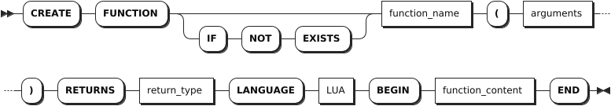
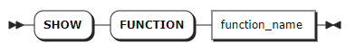
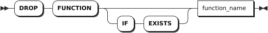

# 自定义函数

KWDB 支持使用 Lua 脚本语言在时序和关系数据库中创建、使用、查看和删除自定义函数。自定义函数的使用方式与 KWDB 其他函数相似。

## 创建自定义函数

### 所需权限

用户拥有当前数据库的 CREATE 权限。

### 语法格式



### 参数说明

| 参数 | 说明 |
| --- | --- |
| `IF NOT EXISTS` | 可选关键字。当使用 `IF NOT EXISTS` 关键字时，如果目标自定义函数不存在，系统创建自定义函数。如果目标自定义函数存在，系统创建自定义函数失败，但不会报错。当未使用 `IF NOT EXISTS` 关键字时，如果目标自定义函数不存在，系统创建自定义函数。如果目标自定义函数存在，系统报错，提示目标自定义函数已存在。|
| `function_name` | 自定义函数的名称。自定义函数的名称不能与已有自定义函数或数据库内置函数同名。|
| `arguments` | 函数参数，需指定参数名称和参数类型，支持的类型包括 TIMESTAMP、INT2、INT4、INT8、FLOAT4、FLOAT8、CHAR、 VARCHAR、NCHAR 和 NVARCHAR。支持指定多个参数，参数之间使用逗号（`,`）隔开。|
| `return_type` | 返回类型。支持的类型包括 TIMESTAMP、INT2、INT4、INT8、FLOAT4、FLOAT8、CHAR、 VARCHAR、NCHAR 和 NVARCHAR。|
| `function_content` | 函数内容，需要使用单引号（`''`）将函数内容括起来。如果函数内容中包含特殊字符，系统会自动进行转义，例如单引号（`''`） 会被转义为`'`。|

### 语法示例

以下示例假设已经创建 `power` 时序数据库 、`consumption` 时序表，并向时序表中写入数据。

```sql
-- 1. 创建 power 时序数据库。

CREATE TS DATABASE power;
CREATE TS DATABASE

-- 2. 切换到 power 时序数据库。

USE power;
SET

-- 3. 创建 consumption 时序表。

CREATE TABLE consumption (k_timestamp timestamp not null,c1 int,c2 int) tags (site int not null) primary tags (site);
CREATE TABLE

-- 4. 设置时序数据库的时区。
SET timezone = 8;
SET

-- 5. 向 consumption 时序表中写入数据。

INSERT INTO consumption VALUES('2024-1-1 1:00:00',1,2,1),('2024-1-1 1:00:00',2,4,1),('2024-1-1 2:00:00',6,3,1),('2024-1-1 5:00:00',8,12,1),('2024-1-1 5:00:00',0,3,1);
INSERT 5
```

以下示例创建并使用 `calculate_growth_rate` 自定义函数来查看 `consumption` 时序表的增长率。

```sql
-- 1. 创建 calculate_growth_rate 自定义函数。

CREATE FUNCTION calculate_growth_rate(previous_consumption int, current_consumption int)
    RETURNS FLOAT
    LANGUAGE LUA
BEGIN
'function calculate_growth_rate(previous_consumption, current_consumption)
  if previous_consumption == 0 then
        return nil
    end
  return (current_consumption - previous_consumption) / previous_consumption
end'
END;
CREATE FUNCTION

-- 2. 使用 calculate_growth_rate 自定义函数。

SELECT calculate_growth_rate(c1,c2) from consumption where k_timestamp >= '2024-1-1 1:00:00' and k_timestamp <= '2024-1-1 5:00:00';

    calculate_growth_rate
----------------------------------
                        1
                      -0.5
NULL
(3 rows)
```

## 查看自定义函数

`SHOW FUNCTIONS` 语句用于查看所有自定义函数或指定的自定义函数的具体信息。

### 所需权限

无

### 语法格式

- 查看所有自定义函数

    

- 查看指定的自定义函数的信息

    

### 参数说明

| 参数 | 说明 |
| --- | --- |
| `function_name` | 待查看的自定义函数的名称。|

### 语法示例

- 查看所有自定义函数。

    ```sql
    SHOW FUNCTIONS;
    ```

    执行成功后，控制台输出以下信息：

    ```sql
          function_name
    ---------------------------
      calculate_growth_rate
    ```

- 查看指定自定义函数信息。

    ```sql
    SHOW FUNCTION calculate_growth_rate;
    ```

    执行成功后，控制台输出以下信息：

    ```sql
          function_name     | argument_types | return_type | function_type | language
    ------------------------+----------------+-------------+---------------+-----------
      calculate_growth_rate | INT, INT       | DOUBLE      | function      | LUA
    (1 row)
    ```

## 删除自定义函数

`DROP FUNCTION` 语句用于删除自定义函数。

### 所需权限

用户拥有当前数据库的 CREATE 权限。

### 语法格式



### 参数说明

| 参数 | 说明 |
| --- | --- |
| `IF EXISTS` | 可选关键字。当使用 `IF EXISTS` 关键字时，如果目标自定义函数存在，系统删除目标自定义函数。如果目标自定义函数不存在，系统删除目标自定义函数失败，但不会报错。当未使用 `IF EXISTS` 关键字时，如果目标自定义函数存在，系统删除目标自定义函数。如果目标自定义函数不存在，系统报错，提示目标自定义函数不存在。|
| `function_name` | 待删除的自定义函数的名称。|

### 语法示例

以下示例删除 `calculate_growth_rate` 自定义函数。

```sql
DROP FUNCTION calculate_growth_rate;
```
