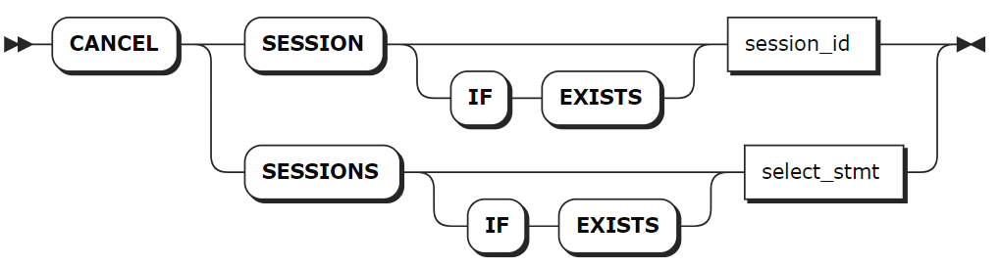
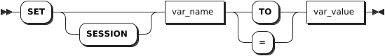

# 会话

## 查看会话

`SHOW SESSIONS` 语句用于查看当前正在进行的会话的详细信息，包括：

- 连接的目标节点
- 打开会话的客户端的地址
- 连接时长
- 会话中正在进行的查询
- 会话中运行时间最长的查询

这些详细信息有助于监控客户端的连接状态，识别可能需要进一步调查或调整的客户端连接。

### 所需权限

- Admin 用户：查看所有用户当前正在进行的会话。
- 非 Admin 用户：查看自己当前正在进行的会话。

### 语法格式


### 参数说明

| 参数 | 说明 |
| --- | --- |
| `CLUSTER` | 可选关键字，查看群集内所有节点上正在进行的会话。|
| `LOCAL` | 可选关键字，查看本地节点上正在进行的会话。|

### 语法示例

- 查看集群内正在进行的会话。

    ```sql
    SHOW ALL CLUSTER SESSIONS;
    node_id|session_id                      |user_name|client_address |application_name|active_queries           |last_active_query                                                                         |session_start             |oldest_query_start       
    -------+--------------------------------+---------+---------------+----------------+-------------------------+------------------------------------------------------------------------------------------+--------------------------+-------------------------
    1      |1757a0b984408f3e0000000000000001|root     |127.0.0.1:41024|ksql            |SHOW ALL CLUSTER SESSIONS|CANCEL SESSIONS (SELECT session_id FROM [SHOW CLUSTER SESSIONS] WHERE user_name = 'stone')|2023-04-20 11:21:44.494261|2023-04-20 11:29:06.56467
    (1 row)
    ```

- 查看当前节点上正在进行的会话。

    ```sql
    SHOW ALL LOCAL SESSIONS;
    node_id|session_id                      |user_name|client_address |application_name|active_queries         |last_active_query        |session_start             |oldest_query_start        
    -------+--------------------------------+---------+---------------+----------------+-----------------------+-------------------------+--------------------------+--------------------------
    1      |1757a0b984408f3e0000000000000001|root     |127.0.0.1:41024|ksql            |SHOW ALL LOCAL SESSIONS|SHOW ALL CLUSTER SESSIONS|2023-04-20 11:21:44.494261|2023-04-20 11:29:54.619584
    (1 row)
    ```

- 使用 `SELECT` 语句通过一个或多个返回字段查看特定会话。

    ```sql
    SELECT * FROM [SHOW ALL CLUSTER SESSIONS] WHERE user_name = 'root';
    node_id|session_id                      |user_name|client_address |application_name|active_queries                                                    |last_active_query      |session_start             |oldest_query_start        
    -------+--------------------------------+---------+---------------+----------------+------------------------------------------------------------------+-----------------------+--------------------------+--------------------------
    1      |1757a0b984408f3e0000000000000001|root     |127.0.0.1:41024|ksql            |SELECT * FROM [SHOW ALL CLUSTER SESSIONS] WHERE user_name = 'root'|SHOW ALL LOCAL SESSIONS|2023-04-20 11:21:44.494261|2023-04-20 11:30:52.835679
    (1 row)
    ```

## 取消会话

`CANCEL SESSION` 语句用于停止长时间运行的会话。

### 所需权限

用户具有 Admin 角色。默认情况下，root 用户具有 Admin 角色。

### 语法格式



### 参数说明

| 参数 | 说明 |
| --- | --- |
| `session_id` | 待取消会话的 ID。用户可以先使用 `SHOW SESSIONS` 语句查看会话 ID。`CANCEL SESSION` 语句只能取消一个会话。如需取消多个会话 ID，需使用 `CANCEL SESSIONS` 语句。|
| `select_stmt` | 查询语句，返回多个待取消会话的 ID。|

### 语法示例

- 取消单个会话。

    ```sql
    -- 查看会话ID
    SHOW SESSIONS;
    node_id|session_id                      |user_name|client_address |application_name|active_queries       |last_active_query                                          |session_start            |oldest_query_start        
    -------+--------------------------------+---------+---------------+----------------+---------------------+-----------------------------------------------------------+-------------------------+--------------------------
    1      |17579fe0cd5626660000000000000001|root     |127.0.0.1:57918|ksql            |SHOW CLUSTER SESSIONS|CANCEL SESSIONS VALUES ('15d9a5cdf28b9f840000000000000001')|2023-04-20 11:06:13.71252|2023-04-20 11:20:54.694478
    (1 row)

    -- 取消特定ID的会话： 
    CANCEL SESSION '17579fe0cd5626660000000000000001';
    CANCEL SESSIONS 1
    ```

- 取消多个会话。

    ```sql
    CANCEL SESSIONS (SELECT session_id FROM [SHOW SESSIONS] WHERE user_name = 'kaiwudb');
    CANCEL SESSIONS 2
    ```

## 查看会话追踪记录

KWDB 使用 OpenTracing 库进行追踪，因此可以轻松集成支持 OpenTracing 的追踪收集器。

- 追踪指作为高级操作（如查询或事务）的一部分而执行的子操作信息。在内部，这些信息以一棵跨度（Span）树的形式表示。
- 跨度（Span）指命名的定时操作，用于描述追踪中的连续工作段。每个父跨度可以包含多个子跨度，每个子跨度代表一个子操作。子跨度可以进一步嵌套子跨度。不同的跨度可以表示顺序执行或并行执行的操作或子操作（并行执行操作/子操作是追踪描述的重要内容之一）。追踪描述的操作可能是分布式的，因此不同的跨度可以描述在不同节点上执行的操作。
- 消息（Message）指带有计时信息的字符串。每个跨度可能包含一系列消息。这些消息类似于节点日志文件中的信息，但是追踪信息包含所有严重级别的信息，而默认情况下日志文件不包含这些信息。因此，追踪信息比日志更详细，但追踪信息仅包含特定追踪操作生成的信息。

`SHOW TRACE FOR SESSION` 语句用于返回 KWDB 在特定会话期间执行的一条或一系列语句的详细信息，包括所有目标节点的消息和计时信息，使得 KWDB 在软件层面采取的操作具有可见性。在 `SHOW TRACE FOR SESSION` 语句中，根跨度代表整个 SQL 事务。

`SHOW TRACE FOR SESSION` 语句主要用于以下几个方面：

- 调试未按预期执行的查询。
- 在错误报告中添加更多信息。
- 了解 KWDB 如何在会话中处理和执行语句。

::: warning 说明

- `SHOW TRACE FOR SESSION` 仅返回最近的会话追踪记录或当前进行的会话追踪记录。
- 如需启用会话追踪，请使用 `SET tracing = on` 命令。启用会话追踪可能会影响系统执行效率，建议仅在需要诊断时启用该功能，诊断结束后停用会话追踪。
- 如需停用会话追踪，请使用 `SET tracing = off` 命令。
- 会话期间的追踪记录不会影响任何 SQL 语句的执行或结果。即使在追踪期间出现错误，KWDB 仍将向客户端返回错误，并在需要时进行自动重试。客户端会收到有关事务重试记录的信息。

:::

### 所需权限

无

### 语法格式


### 参数说明

| 参数 | 说明 |
| --- | --- |
| `COMPACT` | 如果指定，则该语句返回的列较少。|
| `KV` | 如果指定，返回的消息只描述对基础键值存储层的请求和响应消息，包括每结果行消息。当且仅当设置 `SET tracing = kv` 时，`SHOW KV TRACE FOR SESSION` 语句的返回结果才包含每结果行消息。|

### 返回信息说明

| 字段      | 类型        | 描述                                                                                                                                                                                                                               |
| --------- | ----------- | ---------------------------------------------------------------------------------------------------------------------------------------------------------------------------------------------------------------------------------- |
| `timestamp` | timestamptz | 消息发生的绝对时间。                                                                                                                                                                                                               |
| `age`       | interval    | 相对于追踪开始的消息年龄（例如，在 `SHOW TRACE FOR <stmt>` 中为语句执行开始时的年龄，在 `SHOW TRACE FOR SESSION` 中为记录开始                                                                                                          |
| `message`   | string      | 日志消息。                                                                                                                                                                                                                         |
| `tag`       | string      | 消息上下文的元信息。这与日志文件消息开头的信息相同，位于方括号内（例如，`[client=[::1]:49985,user=root,n1]`）。                                                                                                                      |
| `location`  | string      | 产生消息的代码行的文件：行位置。仅部分消息具有此字段。具体取决于消息记录方式。传递给产生消息节点的 `--vmodule` 标志还会影响哪些行将填充此字段。通常情况下，如果指定了 `--vmodule=<file>=<level>`，那么由该文件产生的消息将填充此字段。 |
| `operation` | string      | 记录消息的操作（或子操作）的名称。                                                                                                                                                                                                 |
| `span`      | int         | 按照开始时间排序的所有 span 虚拟列表中的 span 索引。                                                                                                                                                                               |

### 语法示例

- 追踪会话。

    ```sql
    SET tracing = on;
    SET

    SHOW TRACE FOR SESSION;
    timestamp                       |age            |message                                                  |tag                                            |location|operation        |span
    --------------------------------+---------------+---------------------------------------------------------+-----------------------------------------------+--------+-----------------+----
    2023-04-20 11:42:08.481064+00:00|00:00:00       |=== SPAN START: session recording ===                    |                                               |        |session recording|0   
    2023-04-20 11:42:08.481075+00:00|00:00:00.000011|=== SPAN START: sync ===                                 |                                               |        |sync             |1   
    2023-04-20 11:42:08.48109+00:00 |00:00:00.000026|[NoTxn pos:21] executing Sync                            |[n1,client=127.0.0.1:41024,hostnossl,user=root]|        |sync             |1   
    2023-04-20 11:42:15.842138+00:00|00:00:07.361073|=== SPAN START: exec stmt ===                            |                                               |        |exec stmt        |2   
    2023-04-20 11:42:15.842163+00:00|00:00:07.361099|[NoTxn pos:22] executing ExecStmt: SHOW TRACE FOR SESSION|[n1,client=127.0.0.1:41024,hostnossl,user=root]|        |exec stmt        |2   
    2023-04-20 11:42:15.842221+00:00|00:00:07.361157|executing: SHOW TRACE FOR SESSION in state: NoTxn        |[n1,client=127.0.0.1:41024,hostnossl,user=root]|        |exec stmt        |2   
    2023-04-20 11:42:15.84223+00:00 |00:00:07.361166|=== SPAN START: sql txn ===                              |                                               |        |sql txn          |3   
    2023-04-20 11:42:15.842249+00:00|00:00:07.361184|=== SPAN START: exec stmt ===                            |                                               |        |exec stmt        |4   
    2023-04-20 11:42:15.842253+00:00|00:00:07.361188|[Open pos:22] executing ExecStmt: SHOW TRACE FOR SESSION |[n1,client=127.0.0.1:41024,hostnossl,user=root]|        |exec stmt        |4   
    2023-04-20 11:42:15.842255+00:00|00:00:07.361191|executing: SHOW TRACE FOR SESSION in state: Open         |[n1,client=127.0.0.1:41024,hostnossl,user=root]|        |exec stmt        |4   
    2023-04-20 11:42:15.842284+00:00|00:00:07.36122 |planning starts: SHOW TRACE FOR SESSION                  |[n1,client=127.0.0.1:41024,hostnossl,user=root]|        |exec stmt        |4   
    2023-04-20 11:42:15.842288+00:00|00:00:07.361224|not using query cache                                    |[n1,client=127.0.0.1:41024,hostnossl,user=root]|        |exec stmt        |4   
    2023-04-20 11:42:15.842331+00:00|00:00:07.361266|planning ends                                            |[n1,client=127.0.0.1:41024,hostnossl,user=root]|        |exec stmt        |4   
    2023-04-20 11:42:15.842335+00:00|00:00:07.361271|checking distributability                                |[n1,client=127.0.0.1:41024,hostnossl,user=root]|        |exec stmt        |4   
    2023-04-20 11:42:15.842339+00:00|00:00:07.361274|query not supported for distSQL: unsupported node        |[n1,client=127.0.0.1:41024,hostnossl,user=root]|        |exec stmt        |4   
    2023-04-20 11:42:15.84234+00:00 |00:00:07.361275|will distribute plan: false                              |[n1,client=127.0.0.1:41024,hostnossl,user=root]|        |exec stmt        |4   
    2023-04-20 11:42:15.842341+00:00|00:00:07.361277|execution starts: distributed engine                     |[n1,client=127.0.0.1:41024,hostnossl,user=root]|        |exec stmt        |4   
    2023-04-20 11:42:15.842342+00:00|00:00:07.361278|=== SPAN START: consuming rows ===                       |                                               |        |consuming rows   |5   
    2023-04-20 11:42:15.842345+00:00|00:00:07.361281|creating DistSQL plan with isLocal=true                  |[n1,client=127.0.0.1:41024,hostnossl,user=root]|        |exec stmt        |4   
    2023-04-20 11:42:15.8424+00:00  |00:00:07.361335|running DistSQL plan                                     |[n1,client=127.0.0.1:41024,hostnossl,user=root]|        |exec stmt        |4   
    2023-04-20 11:42:15.842404+00:00|00:00:07.361339|=== SPAN START: flow ===                                 |                                               |        |flow             |6   
    2023-04-20 11:42:15.842443+00:00|00:00:07.361379|starting (0 processors, 0 startables)                    |[n1,client=127.0.0.1:41024,hostnossl,user=root]|        |flow             |6   
    (22 rows)
    ```

- 追踪冲突的事务。

    本示例需要同时打开两个终端。

    1. 在终端 1 中，创建表 `t`，开启事务，并执行写操作。

        ```sql
        CREATE TABLE t (k INT);
        CREATE TABLE

        BEGIN;

        INSERT INTO t VALUES (1);
        INSERT 1
        ```

    2. 按回车键，将这些语句发送到服务器。

    3. 在终端 2 中，开启会话追踪并读取表 `t` 中的数据。

        ```sql
        SET tracing = on;
        SET

        SELECT * FROM t;
        ```

        在此情况下，因为终端 1 中的事务没有完成，用户无法读取表 `t` 中的数据。

    4. 在终端 1 中，提交事务。

        ```sql
        COMMIT;
        ```

    5. 在终端 2 中，停止会话追踪并查看已完成的会话追踪。

        ```sql
        SHOW TRACE FOR SESSION;
        timestamp                       |age            |message                                                                                                                                                                                                                                                   |tag                                                         |location|operation                     |span
        --------------------------------+---------------+----------------------------------------------------------------------------------------------------------------------------------------------------------------------------------------------------------------------------------------------------------+------------------------------------------------------------+--------+------------------------------+----
        2023-04-20 11:44:15.801669+00:00|00:00:00       |=== SPAN START: session recording ===                                                                                                                                                                                                                     |                                                            |        |session recording             |0   
        2023-04-20 11:44:15.80168+00:00 |00:00:00.000011|=== SPAN START: sync ===                                                                                                                                                                                                                                  |                                                            |        |sync                          |1   
        2023-04-20 11:44:15.801693+00:00|00:00:00.000024|[NoTxn pos:5] executing Sync                                                                                                                                                                                                                              |[n1,client=127.0.0.1:35128,hostnossl,user=root]             |        |sync                          |1   
        2023-04-20 11:44:23.147975+00:00|00:00:07.346305|=== SPAN START: exec stmt ===                                                                                                                                                                                                                             |                                                            |        |exec stmt                     |2   
        2023-04-20 11:44:23.148+00:00   |00:00:07.346331|[NoTxn pos:6] executing ExecStmt: SELECT * FROM t                                                                                                                                                                                                         |[n1,client=127.0.0.1:35128,hostnossl,user=root]             |        |exec stmt                     |2   
        2023-04-20 11:44:23.148006+00:00|00:00:07.346337|executing: SELECT * FROM t in state: NoTxn                                                                                                                                                                                                                |[n1,client=127.0.0.1:35128,hostnossl,user=root]             |        |exec stmt                     |2   
        2023-04-20 11:44:23.148015+00:00|00:00:07.346346|=== SPAN START: sql txn ===                                                                                                                                                                                                                               |                                                            |        |sql txn                       |3   
        2023-04-20 11:44:23.148036+00:00|00:00:07.346366|=== SPAN START: exec stmt ===                                                                                                                  
        ......
        (196 rows)
        ```

## 查看会话变量

`SHOW SESSIONS` 语句用于查看单个会话或所有会话变量的值。

### 所需权限

无

### 语法格式


### 参数说明

| 参数 | 说明 |
| --- | --- |
| `var_name` | 变量名称，不区分大小写。支持使用双引号（`""`）将变量名称括起来。|

### 语法示例

- 查看单个会话变量的值。

    ```sql
    SHOW DATABASE;
    database                 
    -------------------------
    database name with spaces
    (1 row)
    ```

- 查看所有会话变量的值。

    ```sql
    show session all;
                      variable                 |                                            value
    -------------------------------------------+-----------------------------------------------------------------------------------------------
      application_name                         | $ kwbase sql
      avoid_buffering                          | off
      bytea_output                             | hex
      client_encoding                          | utf8
      client_min_messages                      | notice
      database                                 | defaultdb
      datestyle                                | ISO, MDY
      default_int_size                         | 8
      default_tablespace                       |
      default_transaction_isolation            | serializable
      default_transaction_read_only            | off
      distsql                                  | auto
      enable_implicit_select_for_update        | on
      enable_insert_fast_path                  | on
      enable_zigzag_join                       | on
      experimental_enable_hash_sharded_indexes | off
      experimental_enable_temp_tables          | off
      experimental_serial_normalization        | rowid
      extra_float_digits                       | 2
      force_savepoint_restart                  | off
      idle_in_session_timeout                  | 0s
      idle_in_transaction_session_timeout      | 0
      integer_datetimes                        | on
      intervalstyle                            | postgres
      kwdb_version                             | KaiwuDB 2.0.3.2 (x86_64-linux-gnu, built 2024/05/20 07:07:52, go1.15.14, gcc 9.4.0)
      locality                                 |
      lock_timeout                             | 0
      max_identifier_length                    | 128
      max_index_keys                           | 32
      node_id                                  | 1
      optimizer                                | on
      optimizer_foreign_keys                   | on
      reorder_joins_limit                      | 4
      require_explicit_primary_keys            | off
      results_buffer_size                      | 16384
      row_security                             | off
      search_path                              | public
      server_encoding                          | UTF8
      server_version                           | 9.5.0
      server_version_num                       | 90500
      session_id                               | 17d4737f056950aa0000000000000001
      session_user                             | root
      sql_safe_updates                         | on
      standard_conforming_strings              | on
      statement_timeout                        | 0
      synchronize_seqscans                     | on
      timezone                                 | UTC
      tracing                                  | off
      transaction_isolation                    | serializable
      transaction_priority                     | normal
      transaction_read_only                    | off
      transaction_status                       | NoTxn
      tsinsert_direct                          | off
      vectorize                                | off
      vectorize_row_count_threshold            | 1000
    (54 rows)
    ```

## 设置会话变量

`SET <session_variable>` 语句用于修改单个会话的变量。用户可以使用 `SHOW` 语句查询会话变量。

::: warning 说明
`SET <session_variable>` 语句进行的设置仅对当前会话有效。断开连接并重新连接后，会话变量将恢复为默认值。
:::

### 所需权限

无

### 语法格式



### 参数说明

| 参数 | 说明 |
| --- | --- |
| var_name | 会话变量。|
| var_value | 会话变量的取值。|

下表列出了所有支持配置的会话变量、默认值和可配置的值。

| 变量名称                            | 描述                                                                                                                                                                                                                                                                                                                                                                                                                                                                                            | 默认值                                               |
| ----------------------------------- | ----------------------------------------------------------------------------------------------------------------------------------------------------------------------------------------------------------------------------------------------------------------------------------------------------------------------------------------------------------------------------------------------------------------------------------------------------------------------------------------------- | ---------------------------------------------------- |
| `application_name`                    | 统计收集的当前应用程序名称。可以是空字符串，或者是内置 SQL 客户端使用的 `kwbase sql`。                                                                                                                                                                                                                                                                                                                                                                                                          | 空字符串或 `kwbase sql`                               |
| `bytea_output`                        | 从 STRING 转换为 BYTES 的模式。                                                                                                                                                                                                                                                                                                                                                                                                                                                                 | `hex`                                                  |
| `client_encoding` | 客户端字符集编码，支持以下参数值设置（不区分大小写）：<br>- `utf8` 或 `utf-8`<br/>- `gbk`<br>- `gb18030`<br> **注意**：通过 ODBC 连接 KWDB 时，ODBC 驱动会根据系统的字符编码自动设置字符集。如果需要使用与系统字符集不同的字符集编码，则需手动进行设置。<br> - 使用命令行工具时，避免在使用 GB18030 字符集编码过程中使用 `VARCHAR[]` 数据类型。 | `utf8` |
| `database`                            | 当前数据库。显示连接字符串中的数据库，如果未指定则为空。                                                                                                                                                                                                                                                                                                                                                                                                                                        | 连接字符串中的数据库或空                             |
| `default_int_size`                    | INT8 类型的大小（单位：字节）。                                                                                                                                                                                                                                                                                                                                                                                                                                                                   | `8`                                                    |
| `default_transaction_read_only`       | 当前会话的默认事务访问模式。如果设置为 `on`，则仅允许在当前会话中的事务中进行读取操作。如果设置为 `off`，则允许进行读取和写入操作。                                                                                                                                                                                                                                                                                                                                                                 | `off`                                                  |
| `distsql`                             | 会话的查询分发模式。                                                                                                                                                                                                                                                                                                                                                                                                                                                                            | `auto`                                                 |
| `enable_implicit_select_for_update`   | UPDATE 语句在初始行扫描期间是否使用 `FOR UPDATE` 锁定模式获取锁。                                                                                                                                                                                                                                                                                                                                                                                                                                 | `on`                                                   |
| `enable_insert_fast_path`             | 是否使用专用的执行操作符向表中插入数据，建议此设置保持为 `on`。                                                                                                                                                                                                                                                                                                                                                                                                                                   | `on`                                                   |
| `enable_zigzag_join`                  | 基于成本的优化器是否使用之字形合并连接算法来处理某些查询                                                                                                                                                                                                                                                                                                                                                                                                                                        | `on`                                                   |
| `extra_float_digits`                  | 浮点值显示的小数位数。仅支持 `-15` 到 `3` 之间的值。                                                                                                                                                                                                                                                                                                                                                                                                                                                | `0`                                                    |
| `force_savepoint_restart`             | 设置为 `true` 时，允许 `SAVEPOINT` 语句接受任何名称作为保存点。                                                                                                                                                                                                                                                                                                                                                                                                                                     | `off`                                                  |
| `idle_in_session_timeout` | 自动关闭超过指定超时阈值的空闲会话。取值支持 Duration 和 Integer 类型。如果取值为 `0`，表示会话不会超时。| 取决于 `sql.defaults.idle_in_session_timeout` 集群参数的取值（默认为 `0s`）。 |
| `idle_in_transaction_session_timeout` | 自动终止超过指定阈值的空闲会话。如果设置为 `0`，会话将不会超时。                                                                                                                                                                                                                                                                                                                                                                                                                                  | 集群设置的值，默认 `0` 秒。                            |
| `optimizer_foreign_keys`              | 设置为 `off` 时，将禁用优化器驱动的外键检查。                                                                                                                                                                                                                                                                                                                                                                                                                                                     | `on`                                                  |
| `reorder_joins_limit`                 | 优化器在搜索最佳查询执行计划时尝试重新排序的最大连接数。                                                                                                                                                                                                                                                                                                                                                                                                                                        | `4`                                                    |
| `require_explicit_primary_keys`       | 设置为 `on` 时，会对所有没有显式定义主键的表报错。                                                                                                                                                                                                                                                                                                                                                                                                                                                | `off`                                                  |
| `results_buffer_size`                 | 将语句或一批语句的结果发送到客户端之前累计结果的缓冲区的默认大小。也可以使用 `sql.defaults.results_buffer_size` 集群参数为所有连接设置此值。                                                                                                                                                                                                                                                                                                                                                      | `16384`                                                |
| `search_path`                         | 搜索的模式列表，以解析无资格表或函数名称。                                                                                                                                                                                                                                                                                                                                                                                                                                                      | `public`                                               |
| `server_version_num`                  | 模拟的 PostgreSQL 版本号。                                                                                                                                                                                                                                                                                                                                                                                                                                                                      | 取决于服务器                                         |
| `sql_safe_updates`                    | 如果为 `false`，允许潜在不安全的 SQL 语句，包括删除非空数据库及其所有依赖对象、没有 `WHERE` 子句的 `DELETE`、没有 `WHERE` 子句的 `UPDATE` 和 `ALTER TABLE .. DROP COLUMN`。                                                                                                                                                                                                                                                                                                                                 | 内置 SQL 客户端默认为 `true`，其他客户端默认为 `false`。 |
| `statement_timeout`                   | 语句运行的最长时间。此值可以是 int 类型（例如 10），单位默认为毫秒，也可以是间隔或字符串参数，其中字符串可以解析为有效的间隔（例如 '4s'）。设置为 `0` 时表示无限制。                                                                                                                                                                                                                                                                                                                              | `0s`                                                   |
| `timezone`                            | 当前会话的默认时区。                                                                                                                                                                                                                                                                                                                                                                                                                                                                            | UTC                                                  |
| `tracing`                             | 跟踪记录状态，支持以下配置值：<br >- `off`：禁用会话追踪。<br >- `cluster`：开启会话追踪，收集分布式追踪记录。 <br >- `on`：作用与 `cluster` 相同。 <br >- `kv`：开启会话追踪，收集键值消息。有关详细信息，参见 [查看会话追踪记录](#查看会话追踪记录)。<br >- `local`：开启会话追踪，收集本地节点发出的追踪消息。 <br >- `results`：将结果行和行数复制到会话追踪记录中。必须将其指定为在会话追踪中打印查询的输出。例如：`SET tracing = kv, results;`。 | `off`                                                  |
| `transaction_priority`                | 当前事务的优先级，支持设置为 `LOW`、`NORMAL` 和 `HIGH`。                                                                                                                                                                                                                                                                                                                                                                                                                                              | `NORMAL`                                               |
| `transaction_read_only`               | 当前事务的访问模式。                                                                                                                                                                                                                                                                                                                                                                                                                                                                            | `off`                                                  |
| `vectorize`                           | 矢量化执行引擎模式。选项包括 `auto`、`on` 和 `off`。                                                                                                                                                                                                                                                                                                                                                                                                                                                  | `auto`                                                 |
| `vectorize_row_count_threshold`       | 使用矢量化引擎执行查询计划所需的最小行数。                                                                                                                                                                                                                                                                                                                                                                                                                                                      | `1000`                                                 |

### 特殊语法

- `USE <database>`：相当于 `SET database = ...`。
- `SET NAMES <encoding>`：相当于 `SET client_encoding = <encoding>`。
- `SET SCHEMA`：相当于 `SET search_path =<name>`。
- `SET SESSION CHARACTERISTICS AS TRANSACTION ISOLATION LEVEL ...`：相当于 `SET default_transaction_isolation = ...`。
- `SET TIME ZONE ...`：相当于 `SET timezone = ...`。

### 语法示例

- 将变量设置为单个取值。

    ```sql
    SET database = db4;
    SET


    SHOW database;
    database
    --------
    db4     
    (1 row)
    ```

- 将变量设置为包含空格的值。

    ```sql
    SET database = "database name with spaces";
    SET 


    SHOW database;
    database                 
    -------------------------
    database name with spaces
    (1 row)
    ```

- 将变量设置为多个取值。

    ```sql
    SET search_path = pg_catalog, public;
    SET


    SHOW search_path;
    search_path       
    ------------------
    pg_catalog, public
    (1 row)
    ```

- 设置时区。

    ::: warning 注意

    - 强烈建议用户不要通过变量来设置时区，也尽可能避免为数据库设置会话时间。建议用户在客户端将 UTC 时区转换为所需的时区。
    - 用户可以使用 `SET TIME ZONE` 语句设置当前会话的默认时区。TIMESTAMPTZ/TIMESTAMP WITH TIME ZONE 和 TIMETZ/TIME WITH TIME ZONE 的取值会根据设置的时区进行偏差。默认情况下，KWDB 使用 UTC 时区。
    - 时区缩写区分大小写。除 UTC（别名 utc）外，所有时区缩写必须大写。
    - 时区值表示当前会话的时区。时区值可以是字符串形式的本地系统定义的时区（例如 EST、America/New_York），也可以是相对于 UTC 的正或负数值的时区偏差（例如 `-7`、`+7`）。
    - 当时区值设置为 `DEFAULT`、`LOCAL` 或 `0` 时，意味着将会话时区设置为 UTC。

    :::

    ```sql
    SET TIME ZONE 'EST';
    SET 

    SHOW TIME ZONE;
    timezone
    --------
    EST     
    (1 row)

    SET TIME ZONE DEFAULT;
    SET 

    SHOW TIME ZONE;
    timezone
    --------
    UTC     
    (1 row)
    ```

## 重置会话变量

`RESET` 语句用于将会话变量重置为默认值。

### 所需权限

无

### 语法格式


### 参数说明

| 参数 | 说明 |
| --- | --- |
| `var_name` | 会话变量的名称。|

### 语法示例

以下示例重置 `extra_float_digits` 会话变量。

```sql
-- 1. 设置 extra_float_digits 会话变量。
SET extra_float_digits = -10;
SET

-- 2. 查看 extra_float_digits 会话变量。

SHOW extra_float_digits;
extra_float_digits
------------------
-10               
(1 row)


SELECT random();
random 
-------
0.98785
(1 row)

-- 3. 重置 extra_float_digits 会话变量。

RESET extra_float_digits;
RESET

-- 4. 查看 extra_float_digits 会话变量。

SHOW extra_float_digits;
extra_float_digits
------------------
0                 
(1 row)
```
