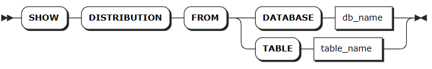

# 存储压缩

## 查看存储和压缩信息

`SHOW DISTRIBUTION` 语句用于查看指定时序数据库或时序表的存储空间和压缩比例。

::: warning 说明
压缩比例为粗略计算值，可能与实际压缩效果存在偏差。计算压缩比时，压缩前的数据长度按建表时指定的列宽计算，因此对于变长列（如 `VARCHAR` 类型），如果定义列宽远大于实际写入数据长度（如定义 `VARCHAR(1000)` 但实际只写入几个字符），会导致压缩比被高估。
:::

### 所需权限

无

### 语法格式



### 参数说明

| 参数 | 说明 |
| --- | --- |
| `db_name` | 待查看的时序数据库名称。|
| `table_name` | 待查看的时序表名称。支持通过 `db_name.table_name` 格式指定查看其他时序数据库中的表。未指定数据库时，表示查看当前数据库下的表。|

### 返回字段说明

**查看数据库时的返回字段:**

| 字段 | 说明 |
| --- | --- |
| `node` | 节点标识。|
| `blocks_num` | 数据块个数。|
| `blocks_size` | 磁盘占用空间大小。|
| `avg_size` | 平均数据块占用空间大小。|
| `compression_ratio` | 粗略计算的压缩比例。|

**查看表时的返回字段:**

| 字段 | 说明 |
| --- | --- |
| `node_id` | 节点标识。|
| `level` | 压缩层级，包括 `last segment` (最新段)、`entity segment` (实体段)和 `total` (总计)。|
| `blocks_num` | 数据块个数。|
| `blocks_size` | 磁盘占用空间大小。|
| `avg_size` | 平均数据块占用空间大小。|
| `compression_ratio` | 粗略计算的压缩比例。|

### 语法示例

- 查看指定数据库的存储和压缩信息。

    ```sql
    SHOW DISTRIBUTION FROM DATABASE iot;
    ```

- 查看指定表的存储和压缩信息。

    ```sql
    SHOW DISTRIBUTION FROM TABLE sensors;
    ```