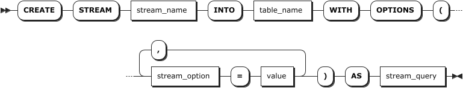
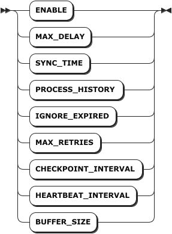
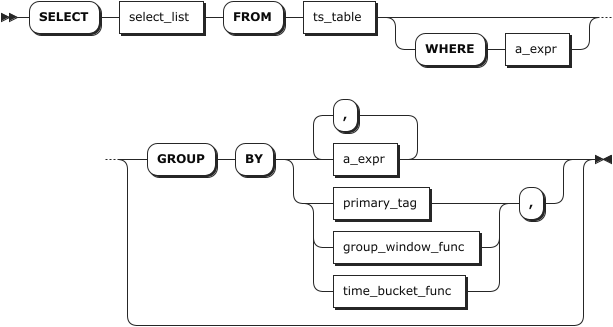

# 流计算

## 创建流计算

`CREATE STREAM` 语句用于创建流计算。

::: warning 说明

创建流计算后，用户不能修改源时序表和目标表的表结构。

:::

### 所需权限

用户是 `admin` 角色的成员或者拥有源时序表的 SELECT 权限和目标表的 INSERT 权限。默认情况下，`root` 用户属于 `admin` 角色。

### 语法格式



- `stream_option`

    

- `stream_query`

    

### 参数说明

| 参数 | 说明 |
| --- | --- |
| `stream_name` | 待创建流计算的名称。 |
| `table_name` | 目标表名称。<br> **说明** <br> 目标表的模式必须与 `stream_query` 参数的 `select_list` 参数兼容。 |
| `stream_option` | 流计算参数。用户可以使用 `ALTER STREAM <stream_name> SET OPTIONS` 语句修改流计算的参数。支持以下参数：<br >- `ENABLE`: 是否启用流计算。支持 `on` 和 `off` 两个取值。`on` 表示启用流计算。`off` 表示未启用流计算。默认为 `on`。 <br >- `MAX_DELAY`：聚合窗口最大持续时间，默认为 `24h`。支持的时间单位包括毫秒（ms）、秒（s）、分（m）、小时（h）、天（d）、周（w）等。 <br >- `SYNC_TIME`：最大允许的乱序数据窗口，默认为 `1m`。<br >- `PROCESS_HISTORY`：是否处理历史数据和断点数据。支持 `on` 和 `off` 两个取值。`on` 表示处理历史数据和断点数据。`off` 表示不处理历史数据和断点数据。默认为 `off`。<br >- `MAX_RETRIES`：流计算发生错误后的重试次数，默认为 `5`。 <br >- `CHECKPOINT_INTERVAL`：流计算的检查点周期，默认为 `10s`。 <br >- `HEARTBEAT_INTERVAL`：流计算的心跳周期，默认为 `2s`。 <br >- `BUFFER_SIZE`：用于流计算聚合计算的缓冲区大小，默认为 `2Gb`。如为普通流计算查询，则不启用。<br > **说明** <br >- 目前，KWDB 只支持在线修改 `ENABLE` 参数。如需修改其它参数，用户需要先停止流计算，然后再修改相关参数。  |
| `value` | 流计算参数的取值。 |
| `stream_query` | `SELECT` 普通查询语法的子集。<br> **说明** <br>- `select_list` 参数必须与目标表的模式兼容。<br>- `select_list` 参数中必须包含 `first(ts)` 和 `last(ts)`且作为最开始的两个输出列，用于记录窗口的开启和关闭时间。否则，历史数据、过期数据和断点数据的处理功能可能处于不可用状态。<br>- 支持窗口函数（会话窗口、状态窗口、时间窗口、事件窗口与计数窗口）和 `Timebucket` 函数。其中，窗口函数仅支持 `GROUP BY [<ptag>,]` 和 `group_window_function`，不支持其它分组条件。<br>- 支持使用 `AS` 子句重命名全部输出列，使其符合目标表的模式定义。<br>- 使用 `TIME_WINDOW` 函数创建流计算时，必须使用 `first_row` 和 `last_row` 函数获取聚合窗口的起止时间。<br>- 使用带滑动窗口的 `TIME_WINDOW` 函数创建流计算时，必须使用 `first` 和 `last` 函数获取聚合窗口的起止时间，然后将其记录到目标表中且作为最开始的两个输出列。|

### 语法示例

以下示例创建一个名为 `cpu_stream` 的流计算。系统使用默认参数启动流计算任务，并以 `1` 分钟为时间窗口、`30s` 为前向增量计算 `benchmark.cpu` 时序表中每个设备（`hostname`）在此时间范围内 `usage_user` 和 `usage_system` 的平均值，并将其结果结果写入目标表 `cpu_avg` 中，同时记录时间窗口的开始及结束时间（`first(ts_timestamp)` 和 `last(ts_timestamp)`）。

```sql
CREATE STREAM cpu_stream INTO cpu_avg AS SELECT first(ts_timestamp), last(ts_timestamp), count(*), avg(usage_user), avg(usage_system), hostname FROM benchmark.cpu GROUP BY TIME_WINDOW(ts_timestamp, '1m', '30s'), hostname;
```

## 查看流计算

`SHOW STREAMS` 或 `SHOW STREAM` 语句用于查看所有或指定流计算的信息，包括流计算名称、目标表、创建参数、创建时间、创建者、当前状态、开始时间、结束时间、失败原因等重要信息。其中，

- 当前状态：启用或未启用流计算。
- 开始时间：最后一次启用流计算的时间，如未开始，则为空。
- 结束时间：最后一次停止流计算的时间，默认为空。
- 失败原因：流计算失败的原因。

### 所需权限

无

### 语法格式


### 参数说明

| 参数 | 说明 |
| --- | --- |
| `stream_name` | 待查看流计算的名称。 |

### 返回字段说明

| 字段                | 说明                                      |
|---------------------|-----------------------------------------|
| `name`              | 流计算的名称。该名称系统内必须唯一。        |
| `target_table_name` | 流计算的目标表的名称。                     |
| `options`           | 流计算的创建参数。                         |
| `query`             | 流计算使用的 `SELECT` 查询语句。           |
| `status`            | 是否启用流计算。                           |
| `create_at`         | 流计算的创建时间。                         |
| `create_by`         | 流计算的创建者。                           |
| `start_time`        | 最后一次开始流计算的时间。如未开始，则为空。 |
| `end_time`          | 最后一次停止流计算的时间。默认为空。        |
| `error_message`     | 流计算失败的原因。                         |

### 语法示例

以下示例查看 `test_stream` 流计算的详细信息。

```sql
SHOW STREAM test_stream;
```

执行成功后，控制台输出以下信息：

```sql
     name     |       target_table_name       |                                                                                                                      options                                                                                                                       |                        query                         | status  |            create_at             | create_by |        start_time         |         end_time          |                                                                     error_message
--------------+-------------------------------+----------------------------------------------------------------------------------------------------------------------------------------------------------------------------------------------------------------------------------------------------+------------------------------------------------------+---------+----------------------------------+-----------+---------------------------+---------------------------+---------------------------------------------------------------------------------------------------------------------------------------------------------
  test_stream | tsdb.public.ts_test_stream_02 | {"enable":"on","max_delay":"24h","sync_time":"1m","process_history":"off","ignore_expired":"on","ignore_update":"on","max_retries":"5","checkpoint_interval":"10s","heartbeat_interval":"2s","recalculate_delay_rounds":"10","buffer_size":"2GiB"} | SELECT * FROM tsdb.public.ts_test_stream WHERE 1 = 1 | Disable | 2025-08-19 08:25:06.940759+00:00 | root      | 2025-08-19 08:25:06+00:00 | 2025-08-19 08:27:11+00:00 | initial connection heartbeat failed: operation "rpc heartbeat" timed out after 6s: rpc error: code = DeadlineExceeded desc = context deadline exceeded
(1 row)
```

## 修改流计算

`ALTER STREAM` 语句用于修改流计算参数。

### 所需权限

用户是 `admin` 角色的成员或者流计算的创建者。默认情况下，`root` 用户属于 `admin` 角色。

::: warning 说明
如果创建流计算的用户被删除后，只有 `admin` 角色成员可以修改流计算。
:::

### 语法格式


### 参数说明

| 参数 | 说明 |
| --- | --- |
| `stream_name` | 待修改流计算的名称。 |
| `stream_option` | 流计算参数。支持以下参数：<br >- `ENABLE`: 是否启用流计算。支持 `on` 和 `off` 两个取值。`on` 表示启用流计算。`off` 表示未启用流计算。默认为 `on`。 <br >- `MAX_DELAY`：聚合窗口最大持续时间，默认为 `24h`。支持的时间单位包括毫秒（ms）、秒（s）、分（m）、小时（h）、天（d）、周（w）等。 <br >- `SYNC_TIME`：最大允许的乱序数据窗口，默认为 `1m`。`SYNC_TIME` 参数的取值必须小于 `MAX_DELAY` 参数的取值。<br >- `PROCESS_HISTORY`：是否处理历史数据和断点数据。支持 `on` 和 `off` 两个取值。`on` 表示处理历史数据和断点数据。`off` 表示不处理历史数据和断点数据。默认为 `off`。<br >- `MAX_RETRIES`：流计算发生错误后的重试次数，默认为 `5`。 <br >- `CHECKPOINT_INTERVAL`：流计算的检查点周期，默认为 `10s`。`CHECKPOINT_INTERVAL` 参数的取值必须小于 `SYNC_TIME` 参数的取值。 <br >- `HEARTBEAT_INTERVAL`：流计算的心跳周期，默认为 `2s`。 <br >- `BUFFER_SIZE`：用于流计算聚合计算的缓冲区大小，默认为 `2Gb`。如为普通流计算查询，则不启用。  <br > **说明** <br >- 目前，KWDB 只支持在线修改 `enable` 参数。如需修改其它参数，用户需要先停止流计算，然后再修改相关参数。<br >- 当用户启动一个处于停止状态的流计算时，系统会检查是否存在断点数据（未处理数据）并使用流计算最低水位线标识断点数据的范围。如果存在断点数据，系统先采用同步方式优先获取并处理水位线之后的历史数据，然后再处理实时数据。如果有窗口函数，在收到第一个实时数据窗口后，系统采用异步方式处理断点处历史数据与实时数据之间的割裂窗口。 |
| `value` | 流计算参数的取值。 |

### 语法示例

以下示例修改流计算参数，停止 `cpu_stream` 流计算。

```sql
-- 停止流计算。
ALTER STREAM cpu_stream SET OPTIONS(enable = 'off');
```

用户也可以直接使用 `ALTER STREAM <name> SET <stream_option> = '<value>'` 的格式修改流计算参数。

```sql
-- 停止流计算。
ALTER STREAM cpu_stream SET enable = 'off';
```

## 删除流计算

`DROP STREAM` 语句用于删除指定的流计算。若系统正在执行流计算，当前批次的流计算正常完成后才能删除指定的流计算。

### 所需权限

用户是 `admin` 角色的成员或者流计算的创建者。默认情况下，`root` 用户属于 `admin` 角色。

::: warning 说明
如果创建流计算的用户被删除后，只有 `admin` 角色成员可以删除流计算。
:::

### 语法格式


### 参数说明

| 参数 | 说明 |
| --- | --- |
| `IF EXISTS` | 可选关键字。当使用 `IF EXISTS` 关键字时，如果目标流计算存在，系统删除目标流计算。如果目标流计算不存在，系统删除目标流计算失败，但不会报错。当未使用 `IF EXISTS` 关键字时，如果目标流计算存在，系统删除目标流计算。如果目标流计算不存在，系统报错，提示目标流计算不存在。 |
| `stream_name` | 待删除流计算的名称。 |

### 语法示例

以下示例删除 `cpu_stream` 流计算。

```sql
DROP STREAM cpu_stream;
```
