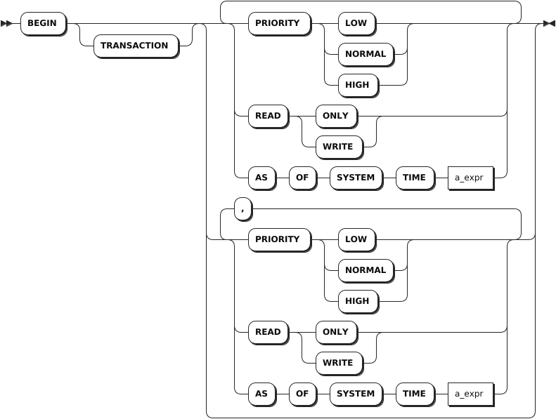
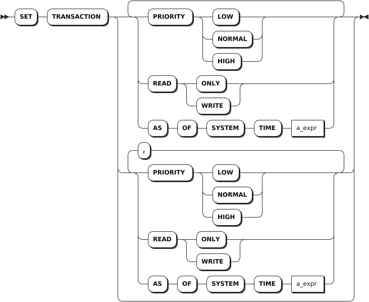

# 事务

事务是指以全有或全无的方式执行的一系列数据库操作。所有操作必须全部成功完成，否则在每个操作中所作的所有更改都会被撤消。

::: warning 说明

- KaiwuDB 支持显式事务内执行时序数据的查询以及写入，但不保证时序引擎的事务性，也不保证跨模查询结果的一致性。
- KaiwuDB 不支持显式事务内执行时序数据的 DDL 操作。

:::

## 启动事务

`BEGIN` 语句用于启动事务，该事务将以全有或全无的方式执行包含的所有语句。在 KWDB 中，`BEGIN` 语句的别名包括：

- `BEGIN TRANSACTION`
- `START TRANSACTION`

### 所需权限

启动事务不需要任何权限。但是，事务中的每个语句都需要相应的权限。

### 语法格式



### 参数说明

| 参数 | 说明 |
| --- | --- |
| `PRIORITY` | 事务的优先级。默认情况下，事务的优先级为 `NORMAL`。用户可以根据需要将事务的优先级设置为 `LOW` 或 `HIGH`。优先级越高的事务，重试的几率越低。|
| `READ` | 事务访问模式，支持 `READ ONLY` 或 `READ WRITE` 访问模式。默认模式为 `READ WRITE`。用户可以通过修改会话变量 `transaction_read_only` 设置访问模式。|
| `AS OF SYSTEM TIME` |  对截至指定时间的数据库内容执行事务。事务访问模式设置为 `READ ONLY` 时才能使用 `AS OF SYSTEM TIME` 子句。如果事务包含任何写操作，或者事务访问模式为 `READ WRITE`，系统将返回错误。|

### 语法示例

以下示例假设已经创建 `accounts`、`orders`、`customers` 表并写入相关数据。

- 采用默认配置启动事务。

    默认情况下，事务采用 `SERIALIZABLE` 隔离级别和 `NORMAL` 优先级。

    ```sql
    -- 1. 启动事务。

    BEGIN;
    Now adding input for a multi-line SQL transaction client-side (smart_prompt enabled).
    Press Enter two times to send the SQL text collected so far to the server, or Ctrl+C to cancel.
    You can also use \show to display the statements entered so far.

    -- 2. 创建保存点 foo。

    SAVEPOINT foo;

    -- 3. 更新 accounts 表。

    UPDATE accounts SET balance = 5000.0 WHERE id = 2;

    -- 4. 向 accounts 表中写入数据。

    INSERT INTO accounts (id, balance) VALUES (9, DEFAULT);

    -- 5. 提交事务。
    COMMIT;
    COMMIT
    ```

- 启动事务，并将事务优先级设置为 `HIGH`。

    ::: warning 说明
    用户也可以使用 `SET TRANSACTION` 语句设置事务的优先级。有关详细信息，参见 [设置事务](#设置事务)。
    :::

    ```sql
    -- 1. 启动事务。
    BEGIN PRIORITY HIGH;
    Now adding input for a multi-line SQL transaction client-side (smart_prompt enabled).
    Press Enter two times to send the SQL text collected so far to the server, or Ctrl+C to cancel.
    You can also use \show to display the statements entered so far.

    -- 2. 提交事务。
    COMMIT;
    COMMIT
    ```

- 启动事务，并使用 `AS OF SYSTEM TIME` 选项设置使用截止到指定时间的数据库内容执行事务。

    ::: warning 说明
    用户也可以使用 `SET TRANSACTION` 语句设置事务的优先级。有关详细信息，参见 [设置事务](#设置事务)。
    :::

    ```sql
    -- 1. 启动事务。

    BEGIN AS OF SYSTEM TIME '2023-04-18 10:00:00.0+00:00';
    Now adding input for a multi-line SQL transaction client-side (smart_prompt enabled).
    Press Enter two times to send the SQL text collected so far to the server, or Ctrl+C to cancel.
    You can also use \show to display the statements entered so far.

    -- 2. 提交事务。
    COMMIT;
    COMMIT
    ```

- 使用自动重试开始事务。

    如果事务中包括 `BEGIN` 和 `COMMIT` 操作，KWDB 支持自动重试批处理所有事务操作。批处理由驱动程序或客户端的行为控制。这意味着 KWDB 一次接收所有语句，而不是分次接收。如果任一语句没有执行成功，用户无需更改任何语句的值。KWDB 会自动重试事务，直到所有语句都执行成功。
    从 KWDB 的角度来看，批量发送的事务执行过程如下：

    ```sql
    -- 1. 启动事务。

    BEGIN;
    Now adding input for a multi-line SQL transaction client-side (smart_prompt enabled).
    Press Enter two times to send the SQL text collected so far to the server, or Ctrl+C to cancel.
    You can also use \show to display the statements entered so far.

    -- 2. 删除 customers 表中 id 取值为 1 的数据。
    DELETE FROM customers WHERE id = 1;
    DELETE 

    -- 3. 删除 orders 表中 customer 取值为 1 的数据。

    DELETE orders WHERE customer = 1;
    DELETE 1

    -- 4. 提交事务。

    COMMIT;
    ```

    在应用程序的代码中，批处理事务通常一次发送多个语句。如下示例将批量发送多个语句，并自动重试。

    ```go
    db.Exec(
      "BEGIN;

      DELETE FROM customers WHERE id = 1;

      DELETE orders WHERE customer = 1;

      COMMIT;"
    )
    ```

## 设置事务

用户执行 `BEGIN` 语句后，但未执行其他数据库语句之前，可以使用 `SET TRANSACTION` 语句设置事务优先级、访问模式以及截止时间戳。

### 所需权限

设置事务不需要任何权限。但是事务中的每个语句都需要相应的权限。

### 语法格式



### 参数说明

| 参数 | 说明 |
| --- | --- |
| `PRIORITY` | 事务的优先级。默认情况下，事务的优先级为 `NORMAL`。用户可以根据需要将事务的优先级设置为 `LOW` 或 `HIGH`。优先级越高的事务，重试的几率越低。|
| `READ` | 事务访问模式，支持 `READ ONLY` 或 `READ WRITE` 访问模式。默认模式为 `READ WRITE`。用户可以通过修改会话变量 `transaction_read_only` 设置访问模式。|
| `AS OF SYSTEM TIME` |  对截至指定时间的数据库内容执行事务。事务访问模式设置为 `READ ONLY` 时才能使用 `AS OF SYSTEM TIME` 子句。如果事务包含任何写操作，或者事务访问模式为 `READ WRITE`，系统将返回错误。|

### 语法示例

- 设置事务优先级。

    ```sql
    -- 1. 启动事务。

    BEGIN;
    Now adding input for a multi-line SQL transaction client-side (smart_prompt enabled).
    Press Enter two times to send the SQL text collected so far to the server, or Ctrl+C to cancel.
    You can also use \show to display the statements entered so far.

    -- 2. 设置事务优先级为 HIGH。

    SET TRANSACTION PRIORITY HIGH;

    -- 3. 提交事务。

    COMMIT;
    COMMIT
    ```

- 设置 `AS OF SYSTEM TIME` 选项。

    ```sql
    -- 1. 启动事务。

    BEGIN;
    Now adding input for a multi-line SQL transaction client-side (smart_prompt enabled).
    Press Enter two times to send the SQL text collected so far to the server, or Ctrl+C to cancel.
    You can also use \show to display the statements entered so far.

    -- 2. 设置事务的 AS OF SYSTEM TIME 选项。

    SET TRANSACTION AS OF SYSTEM TIME '2023-04-18 10:00:00+00:00'; 

    -- 3. 提交事务。

    COMMIT;
    COMMIT
    ```

## 回滚事务

`ROLLBACK` 语句用于中止当前事务及其嵌套事务，丢弃事务语句产生的所有更新。

### 所需权限

回滚事务不需要任何权限。但是事务中的每个语句都需要权限。

### 语法格式


### 参数说明

| 参数 | 说明 |
| --- | --- |
| `savepoint_name` | 保存点的名称，KWDB 支持以下两类事务的保存点：<br >- 嵌套事务：保存点名称可以是任意名称。<br >- 自动重试事务：默认情况下，自动重试事务的保存点名称是 `kwbase_restart`，用户可以根据需要自定义保存点的名称。要使自定义保存点的名称生效，用户需要将 `force_savepoint_restart` 会话变量设置为 `true`。设置生效后，自动重试事务的保存点名称可以是任意名称。|

### 语法示例

- 回滚事务。

    以下示例假设已经创建 `accounts` 表。

    ```sql
    -- 1. 查看 accounts 表的数据。

    SELECT * FROM accounts;
      id | balance
    -----+----------
      1 |    1000
      2 |    2000
      3 |    3000
    (3 rows)

    -- 2. 启动事务。

    BEGIN;
    Now adding input for a multi-line SQL transaction client-side (smart_prompt enabled).
    Press Enter two times to send the SQL text collected so far to the server, or Ctrl+C to cancel.
    You can also use \show to display the statements entered so far.

    -- 3. 更新 accounts 表。

    UPDATE accounts SET balance = 2500 WHERE id = 1;

    -- 4. 回滚事务。
    ROLLBACK;
    ROLLBACK

    -- 5. 查看 accounts 表的数据。

    SELECT * FROM accounts;
      id | balance
    -----+----------
      1 |    1000
      2 |    2000
      3 |    3000
    (3 rows)
    ```

- 重试事务。

    如果 KWDB 开启事务自动重试机制，当事务返回 `40001 / retry transaction` 错误时，用户可以使用该语句重试整个事务。

    ```sql
    ROLLBACK TO SAVEPOINT kwbase_restart;
    ```

- 使用 `ROLLBACK TO SAVEPOINT` 语句实现多级回滚。

    当事务中存在多个保存点时，用户可以使用 `ROLLBACK TO SAVEPOINT` 语句归滚到外层保存点。

    以下示例假设已创建 `kv` 关系表并写入数据。

    以下示例中，事务回滚值 `(6,6)` 和 `(7,7)`，仅将值 `(5,5)` 插入 `kv` 表。

    ```sql
    -- 1. 启动事务。

    BEGIN;

    -- 2. 向 kv 表中写入值 (5,5)。

    INSERT INTO kv VALUES (5,5);

    -- 3. 创建保存点 foo。

    SAVEPOINT foo;

    -- 4. 向 kv 表中写入值 (6,6)。

    INSERT INTO kv VALUES (6,6);

    -- 5. 创建保存点 bar。

    SAVEPOINT bar;

    -- 6. 向 kv 表中写入值 (7,7)。

    INSERT INTO kv VALUES (7,7);

    -- 7. 释放保存点 bar。

    RELEASE SAVEPOINT bar;

    -- 8. 回滚到保存点 foo。

    ROLLBACK TO SAVEPOINT foo;

    -- 9. 提交事务。

    COMMIT;
    COMMIT

    -- 10. 查看 kv 表的数据。

    SELECT * FROM kv;
    k|v
    -+-
    1|1
    2|2
    3|3
    4|4
    5|5
    (5 rows)
    ```

- 使用 `ROLLBACK TO SAVEPOINT` 语句恢复嵌套事务中的错误。

    `ROLLBACK TO SAVEPOINT` 语句支持恢复事务的错误。出现数据库错误后，嵌套事务进入已终止状态。 在这种状态下，事务将不再执行任何其他 SQL 语句。用户可以使用 `ROLLBACK TO SAVEPOINT` 语句恢复嵌套事务中的逻辑错误。 逻辑错误包括：

    - 唯一索引错误（重复行）
    - 外键约束检查失败（引用表中不存在行）
    - 查询中的错误（引用不存在的列）

    ```sql
    -- 1. 启动事务。

    BEGIN;

    -- 2. 创建保存点 error1。

    SAVEPOINT error1;

    -- 3. 向 kv 表中写入值 (5,5)。

    INSERT INTO kv VALUES (5,5);
    ERROR:  duplicate key value (k)=(5) violates unique CONSTRAINT "primary"

    -- 4. 创建保存点 foo。

    SAVEPOINT foo;

    -- 6. 查看事务状态。

    SHOW TRANSACTION STATUS;
    TRANSACTION STATUS
    ------------------
    Aborted           
    (1 row)

    -- 7. 回滚到保存点 error1。

    ROLLBACK TO SAVEPOINT error1;

    -- 8. 向 kv 表中写入值 (6,6)。

    INSERT INTO kv VALUES (6,6);
    INSERT 1

    -- 9. 提交事务。

    COMMIT;

    -- 10. 查看 kv 表的数据。

    SELECT * FROM kv;
    k|v
    -+-
    1|1
    2|2
    3|3
    4|4
    5|5
    6|6
    (6 rows)
    ```

## 提交事务

`COMMIT` 语句用于提交当前事务，或者在 KWDB 开启事务自动重试机制时，清除连接并开始新事务。

- 开启事务自动重试机制后，如果执行 `RELEASE SAVEPOINT` 语句，系统会提交保存点之后执行的语句。此时，需要执行 `COMMIT` 语句，清除连接并开始新事务。
- 未开启事务自动重试机制时，如果事务中的语句运行出现任何错误，`COMMIT` 语句用于中止事务并丢弃其语句产生的所有更新。此时，`COMMIT` 语句等效于 `ROLLBACK` 语句。

在 KWDB 中，`COMMIT` 语句的别名是 `END`。

### 所需权限

提交事务不需要任何权限。但是，事务中的每个语句都需要权限。

### 语法格式


### 参数说明

无

### 语法示例

```sql
-- 1. 启动事务。

BEGIN;

-- 2. 提交事务。

COMMIT;
```

## 创建保存点

SavePoint（保存点）是定义嵌套事务开始的标记。用户可以使用此标记来提交或回滚嵌套事务，而不会影响整个事务的进度。

### 所需权限

创建保存点不需要任何权限。但是，事务中的每个语句都需要相应的权限。

### 语法格式


### 参数说明

| 参数 | 说明 |
| --- | --- |
| `savepoint_name` | 保存点的名称，KWDB 支持以下两类事务的保存点：<br >- 嵌套事务：保存点名称可以是任意名称。<br >- 自动重试事务：默认情况下，自动重试事务的保存点名称是 `kwbase_restart`，用户可以根据需要自定义保存点的名称。要使自定义保存点的名称生效，用户需要将 `force_savepoint_restart` 会话变量设置为 `true`。设置生效后，自动重试事务的保存点名称可以是任意名称。|

### 语法示例

以下示例假设已经创建 `kv` 关系表。

```sql
CREATE TABLE kv (k INT PRIMARY KEY, v INT);
CREATE TABLE
```

- 在事务内建立保存点。

    ```sql
    SAVEPOINT foo;
    ```

    ::: warning 说明
    `SAVEPOINT foo` 和 `SAVEPOINT Foo` 语句都表示创建一个名为 `foo` 的保存点。而 `SAVEPOINT "Foo"` 语句创建一个名为 `Foo` 的保存点。
    :::

- 嵌套事务的保存点。

    事务之间可以使用保存点名称相互嵌套。在嵌套结构中，`RELEASE SAVEPOINT` 和 `ROLLBACK TO SAVEPOINT` 语句都可以指向更高层级的保存点。在这种情况下，系统会自动释放、回滚嵌套结构内的所有保存点。

    - 当回滚先前的保存点后，系统也会将该保存点之后输入的语句进行回滚。有关详细信息，参见[回滚事务](#回滚事务)。
    - 当释放先前的保存点后，系统会将在保存点之后输入的语句进行提交。有关详细信息，参见[释放保存点](#释放保存点)。

- 自动重试事务的保存点。

    `kwbase_restart` 保存点是重试保存点，用于实现自动事务重试，如下所示。

    默认情况下，自动重试事务的保存点名称是 `kwbase_restart`。支持用户自定义保存点的名称。如需使用自定义的保存点，用户需要将 `force_savepoint_restart` 会话变量设置为 `true`。

    ```sql
    -- 1. 启动事务。

    BEGIN;

    -- 2. 创建 kwbase_restart 重试保存点。

    SAVEPOINT kwbase_restart;

    -- 3. 更新 products 表。

    UPDATE products SET inventory = 0 WHERE sku = '8675309';

    -- 4. 向 orders 表写入数据。

    INSERT INTO orders (customer, sku, status) VALUES (1001, '8675309', 'new');

    -- 5. 释放 kwbase_restart 重试保存点。

    RELEASE SAVEPOINT kwbase_restart;

    -- 6. 提交事务。

    COMMIT;
    ```

- 保存点和 `prepared` 语句。

    `PREPARE` / `EXECUTE` 语句不是事务性的语句。因此，回滚保存点时，`PREPARE` 语句仍在事务内保存并执行，不会失效。

    ```sql
    -- 1. 启动事务。
    BEGIN;

    -- 2. 创建保存点 foo。

    SAVEPOINT foo;

    -- 3. 预定义 bar。

    PREPARE bar AS SELECT 1;

    -- 4. 回退到保存点 foo。

    ROLLBACK TO SAVEPOINT foo;

    -- 5. 执行预定义的 bar。

    EXECUTE bar;

    ?column?
    --------
    1       
    (1 row)

    -- 6. 提交事务。

    COMMIT;
    ```

## 释放保存点

`RELEASE SAVEPOINT` 语句使用相同的保存点名称从相应的 `SAVEPOINT` 语句开始提交嵌套事务（包括其嵌套子事务）。`RELEASE SAVEPOINT` 语句进一步支持重试保存点。

### 所需权限

释放保存点不需要任何权限。但是，事务中的每个语句都需要相应的权限。

### 语法格式


### 参数说明

| 参数 | 说明 |
| --- | --- |
| `savepoint_name` | 保存点的名称，KWDB 支持以下两类事务的保存点：<br >- 嵌套事务：保存点名称可以是任意名称。<br >- 自动重试事务：默认情况下，自动重试事务的保存点名称是 `kwbase_restart`，用户可以根据需要自定义保存点的名称。要使自定义保存点的名称生效，用户需要将 `force_savepoint_restart` 会话变量设置为 `true`。设置生效后，自动重试事务的保存点名称可以是任意名称。|

### 处理错误

嵌套事务出现错误后，用户无法使用 `RELEASE SAVEPOINT` 语句消除错误。在这种情况下，用户可以采取以下操作：

- `ROLLBACK TO SAVEPOINT`：回滚到上一个保存点。
- `ROLLBACK` 或 `ABORT`：回滚相关事务。
- `COMMIT`：提交所有相关事务。如果发生错误，`COMMIT` 也用于回滚事务。

当事务（或子事务）出现重试错误时，客户端应重复 `ROLLBACK TO SAVEPOINT` 和事务中的语句，直到语句完整无误，然后再释放保存点。

当嵌套事务出现错误后，如需完全删除其标记并在外部事务中开始其他操作，请立即使用 `ROLLBACK TO SAVEPOINT` 语句，然后再释放保存点。

### 语法示例

- 确认保存点名称是否存在。

    用户无法查看已回滚的保存点名称。以下示例中，事务回滚后，用户无法查看 `bar` 保存点。

    ```sql
    -- 1. 启动事务。

    BEGIN;

    -- 2. 创建 foo 保存点。

    SAVEPOINT foo;

    -- 3. 创建 bar 保存点。

    SAVEPOINT bar;

    -- 4. 回滚到 foo 保存点。

    ROLLBACK TO SAVEPOINT foo;

    -- 5. 释放 bar 保存点。
    RELEASE SAVEPOINT bar;
    ERROR:  savepoint "bar" does not exist

    -- 6. 提交事务。
    COMMIT;
    ```

- 释放保存点，提交事务。

    以下示例中，事务会将事务会将值 `(2,2)` 和 `(4,4)` 写入 `kv` 表中。

    ```sql
    -- 1. 启动事务。

    BEGIN;

    -- 2. 创建 foo 保存点。

    SAVEPOINT foo;

    -- 3. 向 kv 表中写入数据 (2,2)。
    INSERT INTO kv VALUES (2,2);

    -- 4. 向 kv 表中写入数据 (4,4)。
    INSERT INTO kv VALUES (4,4);

    -- 5. 释放 foo 保存点。

    RELEASE SAVEPOINT foo;

    -- 6. 提交事务。

    COMMIT;

    -- 7. 查看 kv 表的数据。

    SELECT * FROM kv;
    k|v
    -+-
    2|2
    4|4
    (2 rows)
    ```

- 释放保存点，提交嵌套事务。

    以下示例回滚内层嵌套事务（由保存点 `lower` 标记），提交外层保存点 `higher`。

    ```sql
    -- 1. 启动事务。

    BEGIN;

    -- 2. 创建 higher 保存点。

    SAVEPOINT higher;

    -- 3. 更新 promo_codes 表。

    UPDATE promo_codes SET rules = jsonb_set(rules, '{value}', '"15%"') WHERE rules @> '{"type": "percent_discount"}';

    -- 4. 创建 lower 保存点。

    SAVEPOINT lower;

    -- 5. 更新 promo_codes 表。

    UPDATE promo_codes SET rules = jsonb_set(rules, '{value}', '"7.5%"') WHERE rules @> '{"type": "percent_discount"}';

    -- 6. 回滚到 lower 保存点。

    ROLLBACK TO SAVEPOINT lower;

    -- 7. 释放 higher 保存点。

    RELEASE SAVEPOINT higher;

    -- 8. 提交事务。
    COMMIT;
    ```

- 释放重试保存点，提交事务。

    指定重试保存点后，用户可以使用 `RELEASE SAVEPOINT` 语句释放保存点，然后使用 `COMMIT` 语句提交事务，为下个事务准备连接。

    ```sql
    -- 1. 启动事务。

    BEGIN;

    -- 2. 创建 kwbase_restart 重试保存点。

    SAVEPOINT kwbase_restart;

    -- 3. 更新 products 表。

    UPDATE products SET inventory = 0 WHERE sku = '8675309';

    -- 4. 向orders 表中写入数据。

    INSERT INTO orders (customer, sku, status) VALUES (1001, '8675309', 'new');

    -- 5. 释放 kwbase_restart 重试保存点。
    RELEASE SAVEPOINT kwbase_restart;

    -- 6. 提交事务。
    COMMIT;
    ```
