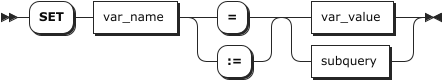

# 自定义变量

自定义变量主要用于在连续执行多个 SQL 语句的过程中，将前序 SQL 语句的结果作为临时变量存储，传递给后续 SQL 语句执行。自定义变量以 `@` 字符开头，采用 `@var_name` 格式。KWDB 提供自定义变量功能，使用户能够在 SQL 语句中直接使用以 `@` 字符开头的变量进行赋值、引用和计算。自定义变量只在当前会话内有效。当客户端退出时，该客户端会话的所有自定义变量都会自动销毁。
自定义变量主要用于表达式运算、条件判断、跨语句数据传递等场景，包括：

- 加减乘除运算表达式运算。
- 作为函数的输入，例如 `CONCAT(@SQL1, @SQL2)`。
- 在 `WHERE` 子句中使用。
- 在 `ORDER BY` 子句中使用。
- 在 `PREPARE` 中用作 SQL 语句。在 `PREPARE` 中使用自定义变量后，更改自定义变量值不会改变 PREPARE 语句的执行结果。
- 在 DML 语句中使用。
- 在 `INSERT` 语句中使用。

::: warning 说明

- 不支持在自定义函数中使用自定义变量。
- 自定义变量与事务状态无关，没有事务性。

:::

KWDB 支持初始化设置自定义变量、更新自定义变量的取值，查询自定义变量的取值和数据类型。自定义变量的类型由初始赋值决定。下表列出自定义变量支持的数据类型。

| 数据类型 | 描述 |
| --- | --- |
| 数值类型 | - 整数类型：INT2、INT4、INT8 <br >- 浮点类型：FLOAT4、FLOAT8 <br >- 定点类型：DECIMAL |
| 布尔类型 | BOOL | 
| 字符类型 | STRING、CHAR、VARCHAR、BYTES、VARBYTES |

KWDB 未对自定义变量数据类型宽度进行限制。初始赋值后，用户无法修改自定义变量的类型。后续赋值必须与初始类型一致，否则系统报错。例如，为整数类型自定义变量赋值浮点类型值时，系统会报错。INT4 和 INT8 都属于整数类型，为 INT4 类型自定义变量赋值 INT8 类型值，系统不会报错。用户也可以使用 `SET @var = <var_value>::<data_type>` 语句为自定义变量赋值指定类型。

::: warning 说明

- 自定义变量不支持隐式类型转换。
- 自定义变量不支持修改 NULL 类型。

:::

## 设置自定义变量

`SET <variable>` 语句用于为单个自定义变量赋值。`SELECT ... INTO` 语句用于为一个或多个自定义变量赋值。`SELECT ... INTO` 语法相当于 `SET <var_name> := <subquery>;`。
对于 `SET` 语句，KWDB 支持 `=` 和 `:=` 两种赋值符号。两种赋值符号的效果相同。对于 `SELECT ... INTO` 语句，当 `SELECT` 查询语句返回单行数据，且返回列数与待设置的自定义变量的个数一致时，系统将结果直接赋值变量。当 `SELECT` 查询语句未返回数据时，系统既不报错也不插入变量取值。

::: warning 说明
自定义变量的设置仅对当前会话有效。断开连接并重新连接后，自定义变量将自动销毁。
:::

### 所需权限

无

### 语法格式

- 使用 `SET` 语句为自定义变量赋值

    

- 使用 `SELECT ... INTO` 语句为自定义变量赋值

    

### 参数说明

| 参数         | 说明                                                                             |
|--------------|--------------------------------------------------------------------------------|
| `var_name`   | 自定义变量。自定义变量以 `@` 字符开头，采用 `@var_name` 格式。                      |
| `var_value`  | 自定义变量的取值。                                                                |
| `subquery`   | `SELECT` 子查询。使用 `SELECT` 子查询为自定义变量赋值时，子查询结果必须为单行单列。 |
| `expr`       | `expr` 表达式。                                                                   |
| `table_name` | 待查询表的名称。                                                                  |

### 语法示例

- 使用 `SET` 语句为自定义变量赋值。

    ```sql
    ---set 赋值
    SET @counter = 10;
    SET

    -- 查看自定义变量的取值
    select @counter;
      @counter
    ------------
            10
    (1 row)
    ```

- 使用 `SELECT ... INTO` 语句为自定义变量赋值。

    以下示例假设已经创建 `orders` 表并写入数据。

    ```sql
    ---select... into 赋值
    SELECT amount INTO @myvar FROM orders LIMIT 1;
    SET 1

    -- 查看自定义变量的取值
    SELECT @myvar;
      @myvar
    ----------
          1
    (1 row)
    ```

- 自定义变量用于运算表达式

    ```sql
    SET @num = 10;
    SET

    SELECT @num * 2 AS double_value, @num + 5 AS increased_value;
      double_value | increased_value
    ---------------+------------------
                20 |              15
    (1 row)
    ```

- 自定义变量作为函数的输入

    ```sql
    SET @prefix = 'Hello';
    SET

    SELECT CONCAT(@prefix, ' World!') AS greeting;
        greeting
    ----------------
      Hello World!
    (1 row)
    ```

- 跨语句传递自定义变量

    ```sql
    SET @avg_salary := (SELECT AVG(salary) FROM employees);
    SET

    SELECT * FROM employees WHERE salary > @avg_salary;
      employee_id | name  | salary  | department  |         hire_date
    --------------+-------+---------+-------------+----------------------------
                5 | Eve   | 7000.00 | Engineering | 2023-04-10 00:00:00+00:00
                7 | Grace | 8000.00 | Engineering | 2023-03-15 00:00:00+00:00
    (2 rows)
    ```

- 自定义变量用于 SQL 构造与执行

    ```sql
    SET @tbl := 'employees';
    SET

    SET @col := 'salary';
    SET

    SET @cond := 'salary >= 6000';
    SET

    SET @dyn_sql := CONCAT('SELECT employee_id, name, ', @col,
                            ' FROM ', @tbl,
                            ' WHERE ', @cond,
                            ' ORDER BY ', @col, ' DESC LIMIT 2');
    SET

    SELECT @dyn_sql;
            @dyn_sql
    -----------------------------------------------------------------------------------------------------
      SELECT employee_id, name, salary FROM employees WHERE salary >= 6000 ORDER BY salary DESC LIMIT 2
    (1 row)

    PREPARE stmt AS @dyn_sql;
    PREPARE

    EXECUTE stmt;
      employee_id | name  | salary
    --------------+-------+----------
                7 | Grace | 8000.00
                5 | Eve   | 7000.00
    (2 rows)

    SELECT employee_id, name, salary FROM employees WHERE salary >= 6000 ORDER BY salary DESC LIMIT 2;
      employee_id | name  | salary
    --------------+-------+----------
                7 | Grace | 8000.00
                5 | Eve   | 7000.00
    (2 rows)

    DEALLOCATE PREPARE stmt;
    DEALLOCATE
    ```

- 自定义变量用于 `WHERE` 子句

    ```sql
    SET @min_salary = 5000;
    SET

    SELECT * FROM employees WHERE salary > @min_salary;
      name | salary
    -------+---------
      c    |   5500
    (1 row)
    ```

- 自定义变量用于 DML 语句

    ```sql
    -- 例：为每行数据更新时累计计数
    SET @low_price := 5000;
    SET

    UPDATE products SET price = price * 2 WHERE price < @low_price;
    UPDATE 2

    SET @discount=1000;
    SET

    UPDATE products SET price = price-@discount WHERE price > @low_price;
    UPDATE 4
    ```

- 自定义变量用于 `INSERT` 语句

    ```sql
    -- 1. 创建表。
    CREATE TABLE t1(a int);
    CREATE TABLE

    -- 2. 为自定义变量赋值。
    SET @ss = 1;
    SET

    -- 3. 向表中插入自定义变量值。
    INSERT INTO t1 VALUES(@ss);
    INSERT 1

    -- 4. 查看表的数据。
    SELECT * FROM t1;
      a
    -----
      1
    (1 row)
    ```

## 查看自定义变量取值

`SELECT <variable>` 用于查看自定义变量的取值。用户查询自定义变量之前，需要先设置自定义变量的初始值，否则系统报错。

### 所需权限

无

### 语法格式


### 参数说明

| 参数       | 说明                                                                |
|------------|-------------------------------------------------------------------|
| `var_name` | 待查看的自定义变量。自定义变量以 `@` 字符开头，采用 `@var_name` 格式。 |

### 语法示例

```sql
---set 赋值
SET @counter = 8;
SET

-- 查看自定义变量的取值
select @counter;
  @counter
------------
        8
(1 row)
```

## 查看自定义变量类型

`SHOW <variable>` 语句用于查看自定义变量的类型。

### 所需权限

无

### 语法格式


### 参数说明

| 参数       | 说明                                                                |
|------------|-------------------------------------------------------------------|
| `var_name` | 待查看的自定义变量。自定义变量以 `@` 字符开头，采用 `@var_name` 格式。 |

### 语法示例

```sql
-- 查询自定义变量类型
SHOW @myvar;
  var_name | var_type
-------------+-------------
    @myvar |    INT8
(0 rows)
```
